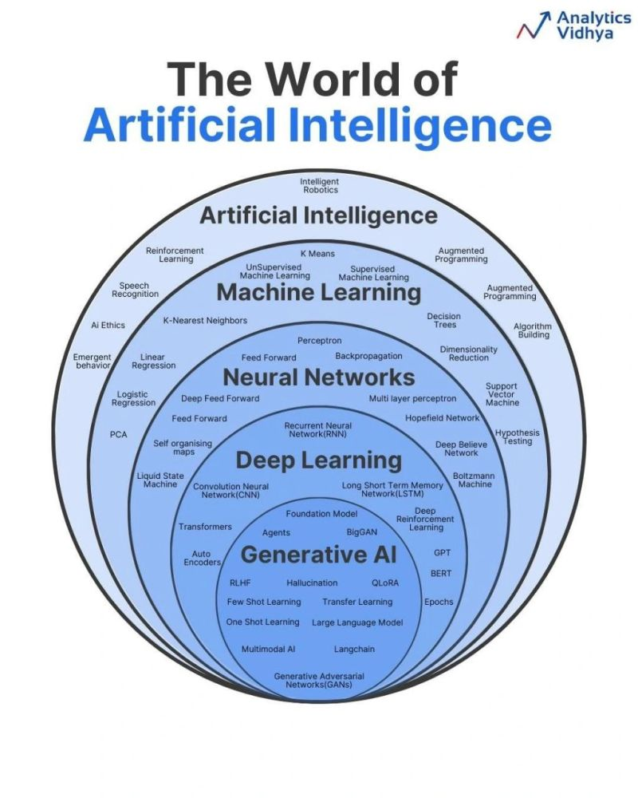

# The Beginning of the End
I think my work so far in semester two has been challenging and rewarding at the same time. We have had three cycles already: first, the human-centered design sprint, where I made an AI web app that can create interdisciplinary courses based on Webb's catalog; second, the independent cycle, where Thomas and I teamed up to get the underwater ROV into a working condition for the Unbounded; and third, the recent macro sprint to research into global challenges, where I looked into SDG 10.3 to think from a design point of view how to accomodate for older adults. In this process, I think I have accomplished more than ever my goals in time management and documentation, the two areas I sought out at the start of semester two to develop because I thought they were critical to the path I wanted to walk. Now, a few months later, I think I have truly improved as a student, innovator, and designer, more knowledgeable about the world as well as more technically inclined. 

I think something I want to do is create a prototype of a basic LLM before the end of the year. I want to learn the data and process behind LLMs through self-learning, and by the sub-goal, have the ability to present to others a basic understanding of how LLMs work and are trained. By the end of the year, I want to have created a very rudimentary model that is either general-purpose or geared towards a specific Webb-related task, e.g., explaining courses for course selection or explaining the handbook. I think this goal is feasible, though it will require me to learn outside of class and mostly on my own, because I am not sure where I could get support besides YouTube or AI. I am fine with this because it means I am pursuing something advanced and high-tech, so naturally, I have to deal with less peer review. However, I think of anything else I will be looking out for human support for both the tech and the process of development, so any help, even just a check-in, would be nice. 

Based on the work I have already done, I want to make sure the influence from what I have already done appears rather than forgetting it and moving on. I want to take from the design sprint the application side of innovation, looking for uses for the LLM I create. I want to be inspired by the underwater ROV's fixing process to look through and learn documentation thoroughly, ready for anything when the time to test it comes along. I want to take from the SDG sprint its ideas of design and accommodation, making sure this project is accessible because, in the end, it is made for me to learn, but also as a demonstration of this advanced, cool system. 

