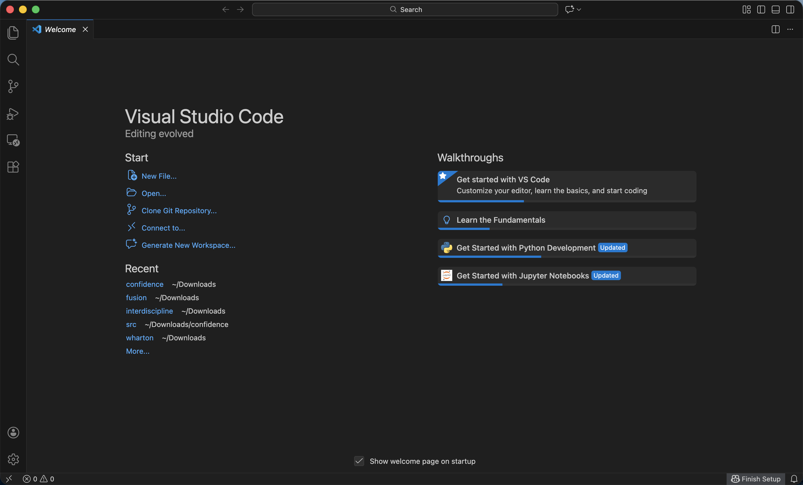
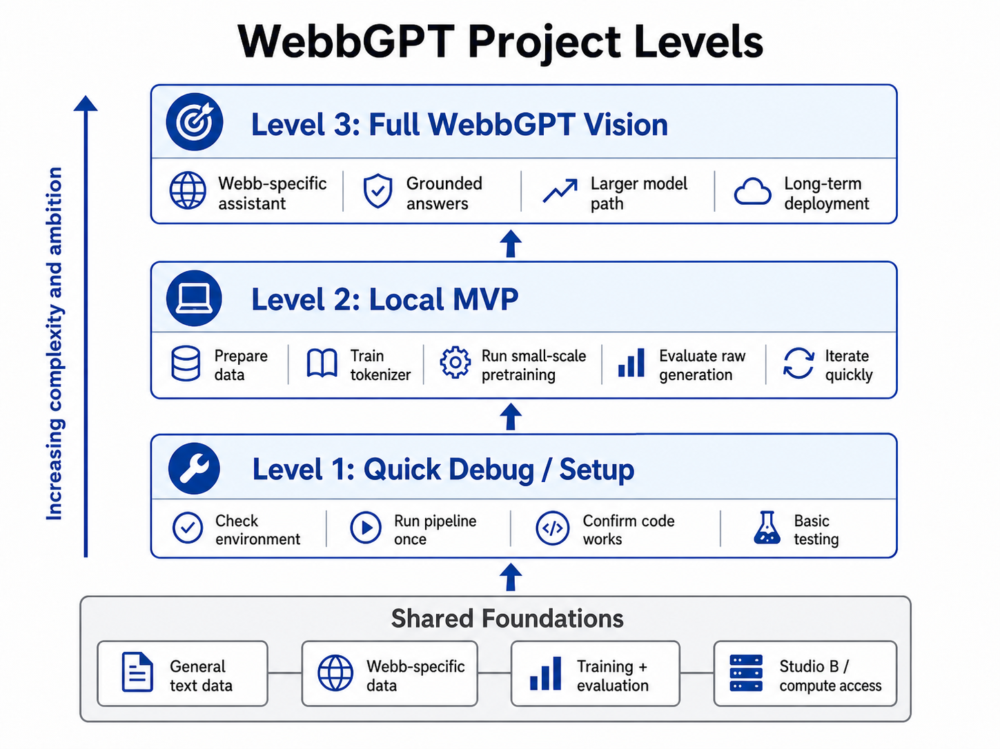

# WebbGPT 0.1

## Motivating Questions + Objective
- How can I build a **language model** that learns to generate readable text?
- How can I create a **local version** of the **larger long-term model**?
- How can I make a Webb-specific assistant that answers questions using **school-grounded information**?

**Objective:** To build a rudimentary large language model, **WebbGPT**, a Webb-specific language model project that can respond with answers built for the Webb community.

## Materials
- VS Code
- Webb-specific grounding
- Fineweb dataset
  

## Step-by-Step Process
1. **Separate the levels of the project**: I first realized that this project could not be done in one go, so I divided its complexity into different levels: a quick debug to check everything worked, a full version of a Webb-specific assistant, and a smaller local minimum viable product that could be iterated one faster with splits into steps like preparing data, training a tokenizer, and running pretraining for more accessibility. Separating these levels made the project feel more manageable because I could work on the local MVP without losing sight of the larger goal.

2. **Find the data**: After separating the project into levels, I focused on finding useful training material. I needed both broad general text and Webb-specific data, so I used FineWeb-style, which had internet text from many years, and the official Webb website to link the model to the school context. 

[Fineweb](https://huggingface.co/datasets/HuggingFaceFW/fineweb)

[Webb-specific](webb.org)

3. **Learn from YouTube videos and research papers**: To learn how language models work, I used YouTube videos and other explanations to understand the basic training pipeline. I learned more about tokenizers, pretraining, model size, attention, and transformers.

- [Large Language Models explained briefly](https://www.youtube.com/watch?v=LPZh9BOjkQs&list=PLZHQObOWTQDNU6R1_67000Dx_ZCJB-3pi&index=6): a brief explanation of what large language models are and why predicting text can create useful behavior.
- [Transformers, the tech behind LLMs](https://www.youtube.com/watch?v=wjZofJX0v4M&list=PLZHQObOWTQDNU6R1_67000Dx_ZCJB-3pi&index=7): an explanation of the Transformer architecture behind modern language models.
- [How might LLMs store facts](https://www.youtube.com/watch?v=9-Jl0dxWQs8&list=PLZHQObOWTQDNU6R1_67000Dx_ZCJB-3pi&index=9): an explanation of how facts and knowledge may be represented inside language model weights.
- [They solved AI’s memory problem!](https://www.youtube.com/watch?v=2IfAVV7ewO0&list=LL&index=15): a video on how AI systems can use memory or retrieval to work with information beyond a single prompt.
- [They solved AI hallucinations!](https://www.youtube.com/watch?v=1ONwQzauqkc): a video on the root of hallucinations within neural networks; thus, they have a way to notice when hallucinations happen to ensure reliable information.
- [The Math Needed for AI/ML (Complete Roadmap)](https://www.youtube.com/watch?v=YZOAiJmnNvc&list=LL&index=22): a roadmap of the math foundations needed to understand machine learning.

- [Attention Is All You Need](https://arxiv.org/abs/1706.03762): the original Transformer paper that introduced the architecture behind many modern LLMs.
- [A Mathematical Framework for Transformer Circuits](https://transformer-circuits.pub/2021/framework/index.html): a technical framework for understanding how Transformer components may form interpretable circuits.
- [Superposition Yields Robust Neural Scaling](https://arxiv.org/abs/2505.10465v4): a research paper connected to how neural networks may represent more features than they have obvious separate dimensions for; thus, LLMs are slowly reaching their limit.

4. **Create a prototype**: Once I had a better understanding of the pipeline, I created a local MVP prototype. This prototype was not meant to be the final version. Instead, it was a smaller test model that could test the basic process: prepare data, train a tokenizer, configure the model, run pretraining, and evaluate raw generation quality.

5. **Get permission from the Tech Office to use Studio B**: Training even a small language model takes time and hardware resources, so I needed to use the Studio B machine. Thus, I had to communicate my intentions and project to the Tech Office to gain access, which tested my ability to interact with others in tech spaces.

6. **Iterate slowly**: After getting the project running, the process became a slow iteration. I looked at training logs, checked perplexity, reviwed bad generation samples, adjusted configs, cleaned data, and tried to understand why the model behaved as it did. The project is still in early development, but each cycle provides more information about what needs improvement next.

  <iframe 
    src="files/studio-b-request.pdf" 
    width="100%" 
    height="100%" 
    style="border: none;">
  </iframe>

  <iframe 
    src="files/webbgpt-final-eval.pdf" 
    width="100%" 
    height="100%" 
    style="border: none;">
  </iframe>

## Problems + Solutions
- **Large training runs are expensive**: Training a serious language model can take a lot of compute, so the project uses smaller local profiles first. The debug profile proves the pipeline works, while local-mvp gives a local test to iterate and work on without having to worry about time.
- **Quality vs complexity**: A model can appear to be learning through certain measurements but actually be failing generally. WebbGPT handles this by using evaluation files, validation data, test cases, experiment notes, and many qualitative samples that track problems like topic drift, semantic loops, and weak catalog accuracy.

  <iframe 
    src="files/webbgpt-training.pdf" 
    width="100%" 
    height="100%" 
    style="border: none;">
  </iframe>

## Main Takeaways
- **Local testing matters**: Having debug and local-mvp profiles makes the project easier to develop because changes can be tested before running larger experiments. Without this distinction, I would be running week-long training sessions without any confirmation of whether a model looked good or not. This could slow iteration and progress to a crawl. 
- **Grounding improves trust**: Connecting answers to Webb data and citations makes the assistant more useful because users can see where information came from instead of blindly trusting generated text. Thus, I wanted to make sure my data was clean and always trustworthy. 

<video controls width="600">
  <source src="images/webbgpt-sample.mp4" type="video/mp4">
</video>

  <iframe 
    src="files/webbgpt-README.pdf" 
    width="100%" 
    height="100%" 
    style="border: none;">
  </iframe>

## Reflection
WebbGPT is a project I like to characterize with duplicity. This is both because I like the word, because I think it is cool, and because the project has two parts: learning LLMs to present and create a version of it myself. Despite the creation process being the more challenging part, the focus is still on learning and bettering myself on this topic that stands at the forefront of a field I am interested in, AI. I cannot say I do not feel lost at times working on this, especially when problems occur. However, I understand I still have time, and this project is not meant to be straightforward, never mind easy. Thus, I hope this checkpoint shows that I have put in the time and progress, and I want to slowly work towards presenting about LLMs, the USC event, and the final product of WebbGPT 0.2.
