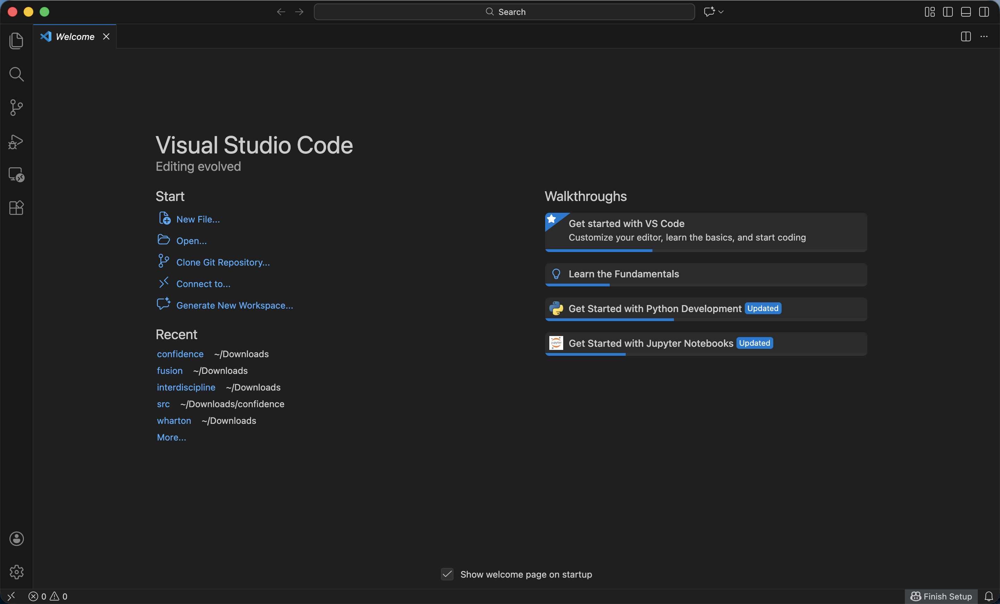
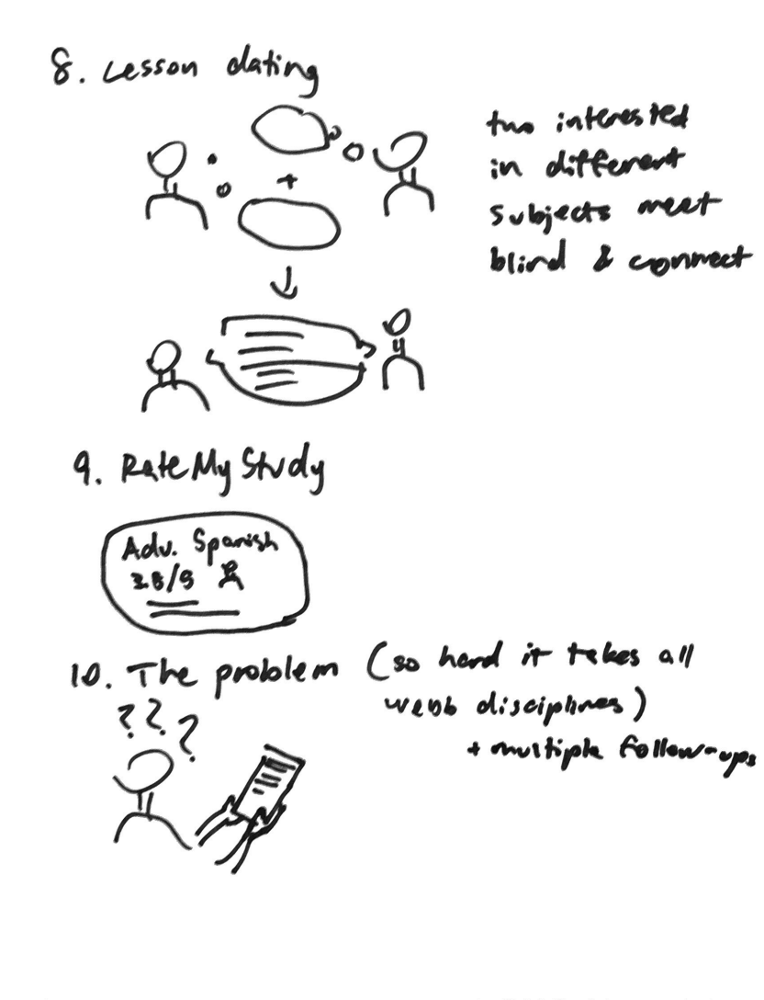
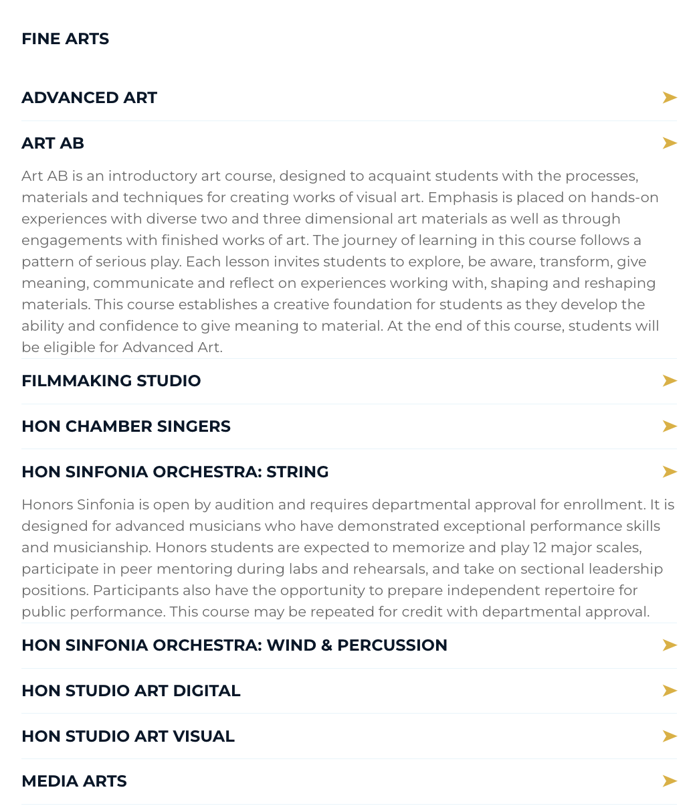
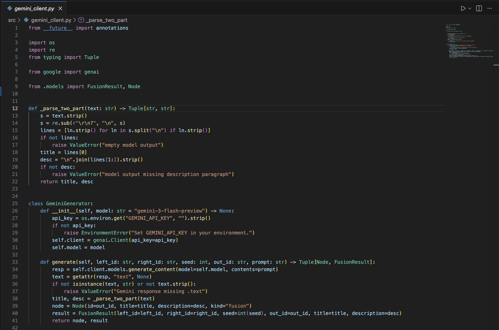
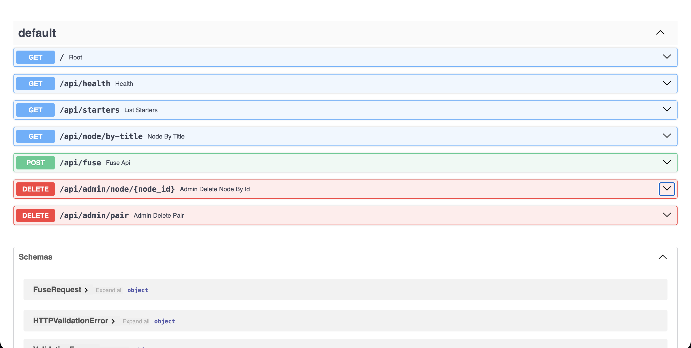
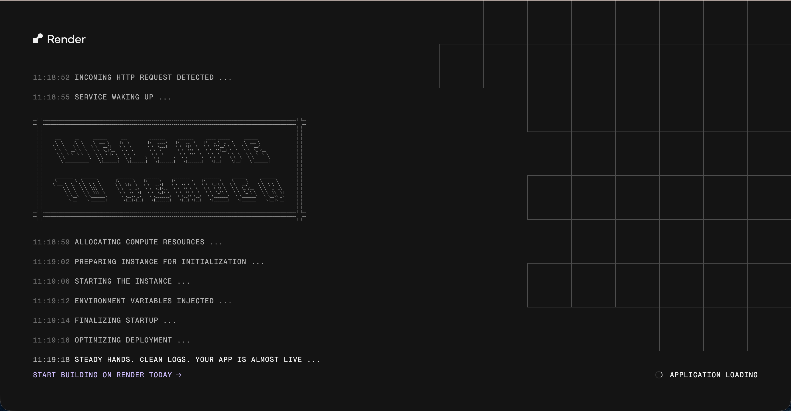
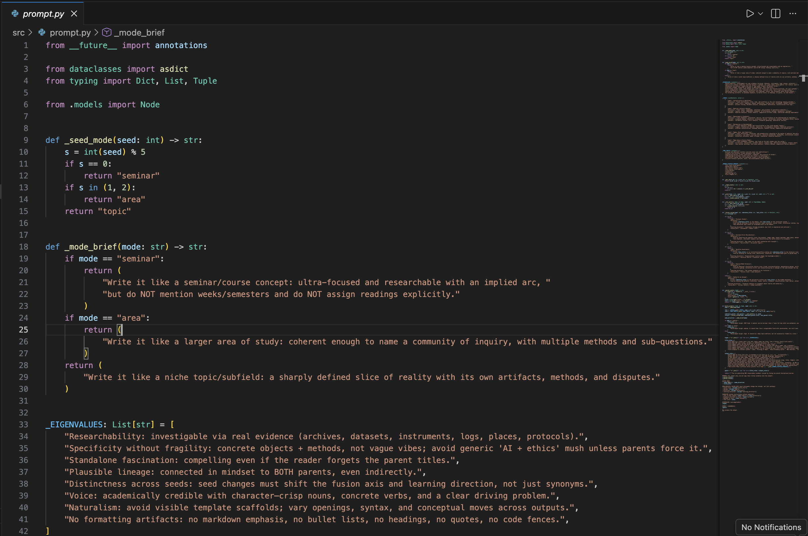
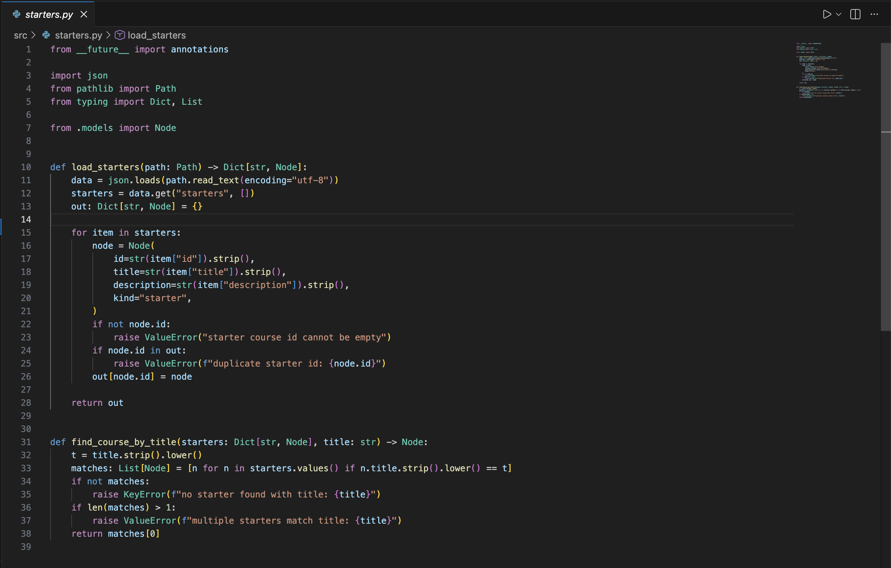
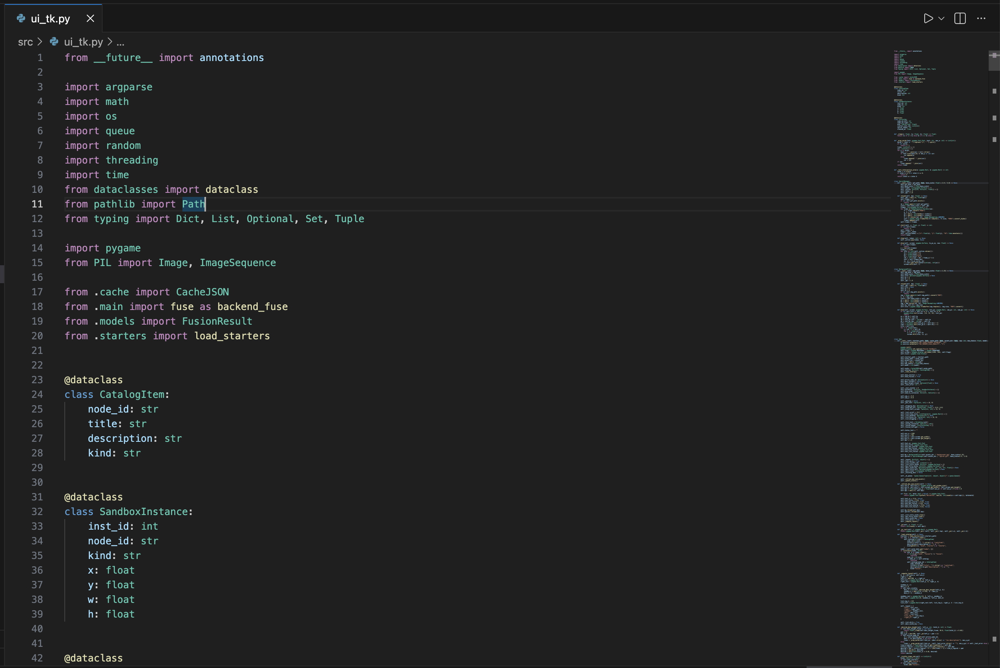
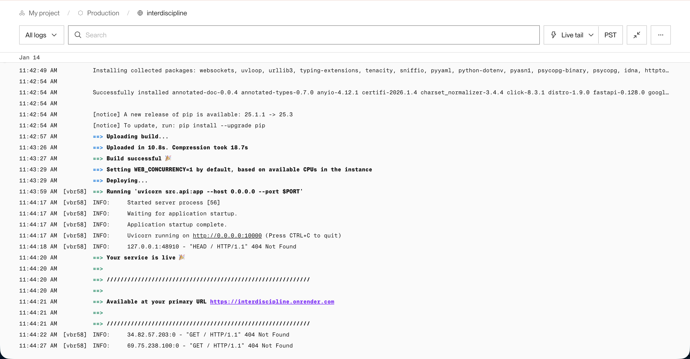

## Motivating Questions + Objective
- How can I interview someone to uncover problems they notice from their **unique perspective**?
- How can I generate solutions to Mr. Strom’s concern about a **lack of interdisciplinary overlap** at Webb?
- How can I build an **app with a UI** that offers a creative, intuitive response to that concern?

**Objective:** Address Mr. Strom’s concern by creating a way to increase **interdisciplinary engagement** in the program.

## Materials
- VS Code

## Step-by-Step Process
1. **Interview** I approached Mr. Strom cold and asked if he had time for a quick interview. I kept it simple with a few warm-up questions, one central question, and lots of follow-ups. I am actually really proud of my follow-ups because each one tried to dig into something specific he had just said, so the interview felt like it was building momentum instead of jumping around. I also left room for a few fun questions, which he seemed to enjoy.
2. **Drafting 10 ideas**: Coming up with ten distinct ideas was harder than I expected, especially under time pressure. A lot of early ideas felt like variations of the same concept, so the challenge was forcing myself to think beyond parodies of each other.
3. **Isolating one**: I chose the idea that felt the most intuitive and uniquely suited to the problem. It was high tech, but I knew I would regret not attempting it.
4. **Discovering Gemini**: I have never intentionally used Gemini before, especially not its API. I had to create an account, get an API key, and learn how the request/response workflow works. I was able to use free credits for now, but long-term, it would require a paid plan.
5. **Scrapping for starters**: I needed starter courses as the raw material for fusions, so I went through Webb’s course catalog and manually copied course names into a starter dataset. This process took half an hour; I'm slow.
6. **Base code**: I wrote the core code for calling the API and structured it across multiple files so it could function as a real system rather than one messy script.
7. **Prompt Adjustment**: This took the most iterations which is to say 50+ rounds of trial-and-error. I ended up with a prompt system that uses up to five seeds to generate different angles, encourage niche connections, and avoid generic results.
8. **Overextending with Onrender**: I jumped too early into hosting (without even having a UI) using a platform I had never used before. I hoped it would be quick, but it turned out to be too complex for what I needed at that stage, so I had to backtrack.
9. **Tkinter UI**: I built a UI in Tkinter and iterated on it a lot (50+ tries) to get to a version that was organized and usable. This became the most complex UI I have made, mostly because I rarely build interfaces.
10. **Pygame Pivot**: As the UI got more ambitious, performance became an issue. For the MVP, I pivoted toward Pygame to keep the interface responsive while still making it visually acceptable.
   

## Problems + Solutions
- **Proper pacing**: I got overly excited and tried to complete everything too early, jumping into deployment (Onrender) before the UI and workflow were stable or, honestly, really existing. That created a time sink because I was debugging platform issues while the product itself was still changing. The solution was to backtrack, treat deployment as a final step, and prioritize a working local MVP first with data, then the backend, then the UI, then finally thinking about deployment. 
- **Finding time**: With Science Fair and other classes happening at the same time, I could not rely on long, uninterrupted work sessions. When I tried to cram, I made messier decisions and lost time re-reading my own code. The fix was working in shorter, focused sessions, building the project in clean layers so I could resume quickly without getting lost.

## Main Takeaways  
- **Interviews = insight**: Interviews give you access to someone else’s perspective, and that model can feel like a different universe. As a student, I mostly experience Webb as a place designed to push me personally, so I do not naturally think about its structure as a system. Mr. Strom viewed the program structurally, focusing on its intent, its patterns, and where interdisciplinary overlap could be encouraged. The interview helped me see the problem at the institutional level, not just the student level.
- **Scope requires organization, not just effort**: Working for hours is not useful if the project becomes a fog where nothing is where you expect it to be, which is exactly what happened to me. When I tried to treat the project as one giant object in my head, I lost track of what was solid and what was experimental, which made me waste time and nearly restart. The takeaway was that scope gets handled by the organization by having a properstep-by-step building process so that the project expands predictably and piecewise in a way that makes sense in my head. 

  

## Reflection
This project felt refreshing because it had minimal constraints and was aimed at solving one real person’s real concern, which gave me a lot of creative freedom. The interview stage especially felt open-ended in a good way: as long as I stayed loyal to the core problem, I could explore interesting directions without feeling boxed in.

My biggest insight came from learning how to manage scope under time pressure, and I learned it the hard way by doing it wrong first. Very wrong. After getting burnt out by jumping ahead to exciting steps, I had to slow down, rebuild from stable foundations, and focus on what was necessary before what was flashy. That shift to the foundations first and polishes later was the difference between a messy experiment and a usable product, and the difference between a would-be and an actual project I can show off.

I am proud of what I finished, especially while juggling other deadlines and treating this as an experimental build. I had never structured an interview like this, never intentionally used an LLM API, and had not made a real UI in years, so a lot of the work involved learning-by-doing. Even when parts went wrong, it stayed fun because each obstacle forced me to expand what I actually know how to build. All in all, I really enjoyed this project. 
