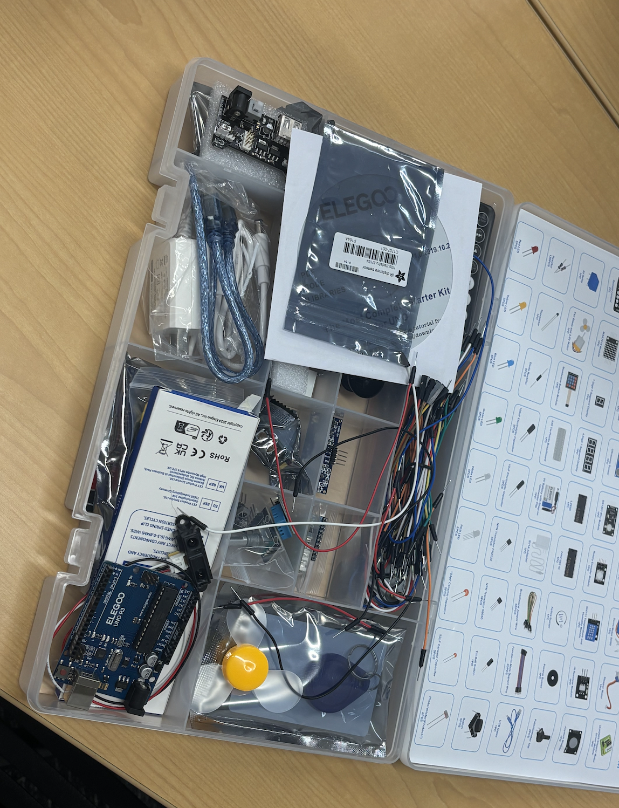
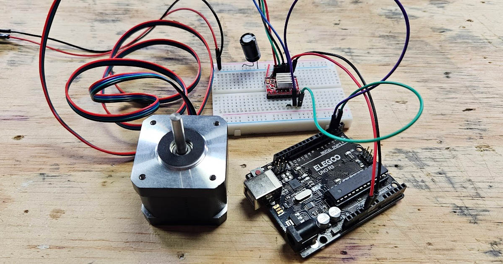
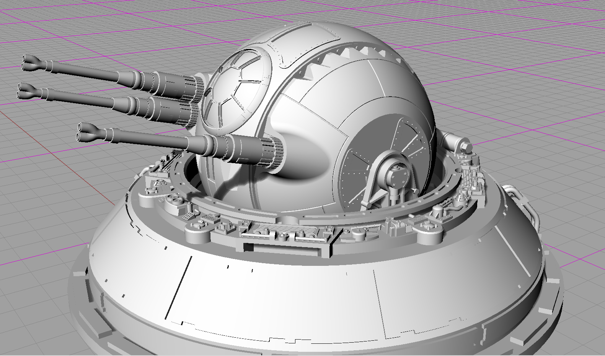
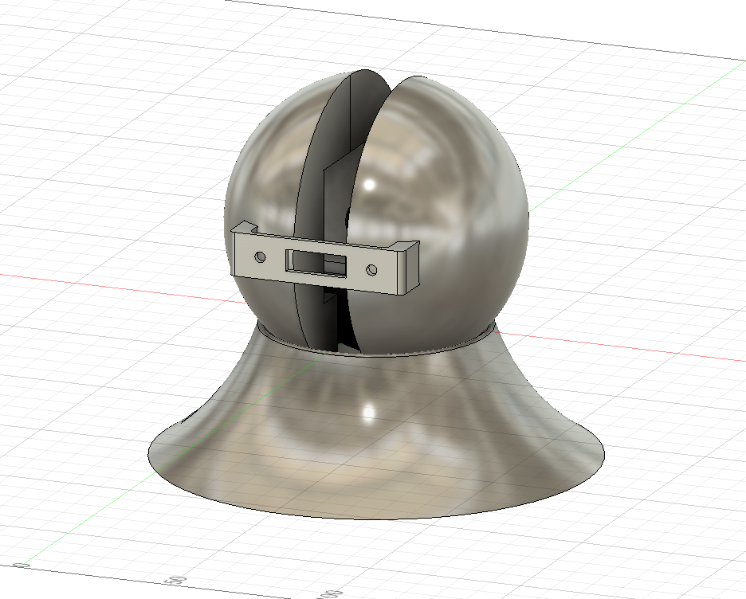
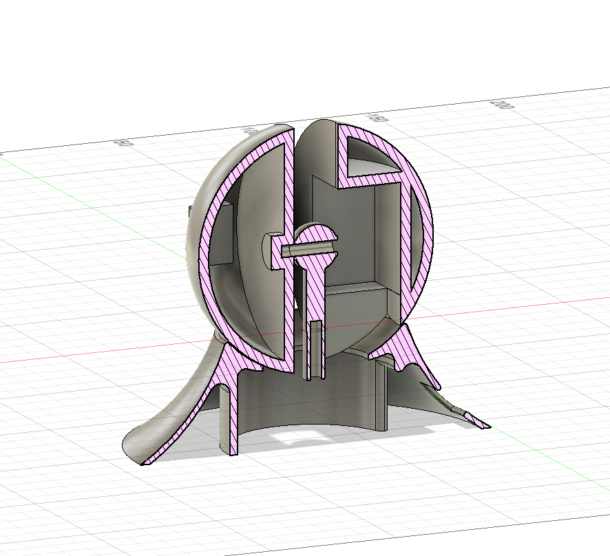
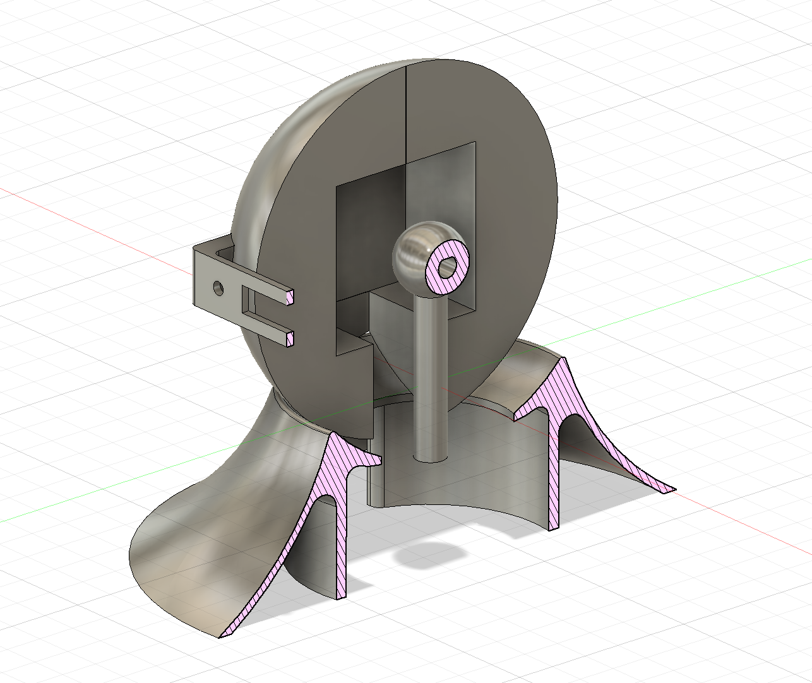

# 

## Motivating Questions + Objective
- How can I **bridge hardware with software** or **join CAD and code** to create a **3D scanner** that uses this mechanism?
- How can I **connect with my peers** to implement an aspect I did not explore in depth?

**Objective:** 

## Materials
- VS Code
- Arduino IDE
- Fusion 360 for CAD modeling  
- 2 stepper motors (25mm tall NEMA 17)  
- Screws and mounting hardware
- UNO R3 Super Starter Kit
- Sharp GP2Y0A21YK0F IR Distance Sensor
- USB cable
- Completed & printed gimbal

## Step-by-Step Process
1. **Initial concept and inspiration:** I thought of the Star Wars ball turret and considered how two axes would work. I knew the two servos would need an orientation where they were pointed up and to the side in order for the movement to work. Based on these fundamentals, I applied them to this idea of a ball turret to create the basic idea of the design components.
2. **Test low-fidelity prototypes:** I tested for friction with simple designs that took around 20 minutes each, interacting with the 3D printer and servos actively.
3. **Researching dimensions:** I found a reference sheet in Chinese, used a ruler to find other unknowns, and contacted others for their measurements in order to understand the dimensions that fit into the design.
4. **Create medium-fidelity look-alike:** I used these measurements and created a crude, dysfunctional look-alike that served its role by showing me the dimensions in context, allowing me to tweak the design within the CAD software without having to move to higher fidelity or the real world yet.
5. **Finalize design:** The design idea became finalized and the components were selected to be a certain way. CADing took up most of the time here since each part of the idea had to be recognized and completed.
- The design has five components: the mount, the right hemisphere, the left hemisphere, the axis, and the base. The mount is inserted into sockets on both hemispheres and has holes to hold screws for the scanner. The right hemisphere is where the rest of the shaft of the horizontally facing servo is inserted. The left hemisphere is where the horizontally facing servo is contained, with a cut-out at the bottom for the cables to pass through. The axis is a stick with a ball at the top that has another shorter stick going through it. The axis has the holders for the servos’ shafts to be inserted into. Finally, the base is used to balance the servos and the hemispheres. Most of it is hollow to allow for cables, and it has a hole on the side to connect the cables to the Arduino outside.
6. **Iterative design with revision:** I printed on Wednesday at 5:30, 8:30, and 9:00, and on Thursday at 8:30 and 9:00, and the final print started at 11:30. These prints tested different parts such as offset, the fitting of the motors, the fitting of all the components, and more. Each time I discovered a list of three to five things to revise and edit. Some changes took five minutes, while others required a full run-through of the CAD to edit everything, taking up to an hour. Overall, CADing time amounted to close to four hours in one day.
7. **Present and demonstrate final design:** I aimed to present this design in a way that is educational and informative, so I made this design open-source. This means providing a link to the download for anyone who wishes to explore or pursue this idea.

Download [.fbx](downloads/stepper.fbx) or [.f3d](downloads/stepper.f3d) here

 

## Problems + Solutions
- **Finding dimensions**: Finding a reference sheet for the NEMA 17 motor required research. I eventually found a Chinese reference diagram and used it to get most of the numbers, but I was still missing the height of the motor base and the jut-out for the cable. I had to measure those myself. I still needed those dimensions for the scanner as well, so I reached out to Patrick and asked for them because I did not know them and he had just measured them before me. This showed me just how deep the need for proper measurements is for any form of design.
- **Finding leeway**: I needed to find the extra space to give the shaft so that it maximized friction while still allowing the shaft to slide in without a big struggle. I leveraged the D-shaped shaft to create a better fit, which made the fit directional. Initially, it was too tight at 0.10 mm, and it was still too tight at 0.15 mm. The final design had 2.5 mm of offset, which worked.

## Main Takeaways  
- **Mechanical design is iterative:** Almost every part needed multiple revisions as new constraints appeared. I had to change the offset of the shaft holders three times, the length of the vertical holder was too short, the base was too short, the holder for the bottom servo was too tight, the length was miscalculated for the horizontal servo holder, the cable jut-out was miscalculated so it did not fit, the space for wires inside the base and ball was too little, the first print of everything melded together, the printer ran out of filament for a complete print that happened overnight, the axis ball and stick failed to print twice due to weaker support from the bottom and a heavy head, the ball itself was underestimated two times during the CADing process, the servo height was underestimated until it was finally measured, the printer spaghetti-ified on the final print (shoutout Henry for saving this project as a heroic passerby who restarted the print), and the model was without smooth edges for two iterations. These are problems that would have never been solved without revisions, and each of them was enough to break the project.
- **Importance of lower fidelity for testing:** This process would have been much worse if I had not taken the time to print smaller sections and allow imperfection. My photo in context was an amalgamation to the point of being an abomination, with parts from four different print jobs of the five components possible. Allowing imperfection to occur in order to push for progress was what allowed this project to take shape in such a short time span.

  

## Reflection
When I first heard of this project on Tuesday, I was overwhelmed and did not know what to do. However, I think my approach this time helped despite the time crunch, along with all the other challenges. I tried to focus on the iteration I was on currently, never trying to overpush or expect too much from any single try I made. I kept myself organized and focused on whatever I was doing and working toward at that stage, without any care for appearances.

This project felt the best out of all the projects I have done this year, including PNP. I felt like, in the short time span of around a day, I spent my time efficiently and brought a product no one else was able to create. I know I spent many hours CADing with a passion and checked the 3D printers more than ten times a day to check my CAD as well as to print, using all the time available to me to their fullest, despite dorm meetings, study halls, summatives, and an already tight schedule. I felt like I took this one the smartest, playing with the fidelity and incompleteness without worry for appearances or for a finished iteration every time. I felt like I wanted to show my process, not my final result.

In doing that, I was able to put more progress into creating a final result that I was able to revisit and revise multiple times, and one that I can say I am very proud of. All in all, I feel proud of the work I have done, and I think I should be able to recognize the growth I have had over the year, especially with the original rocky first impression of this project.
