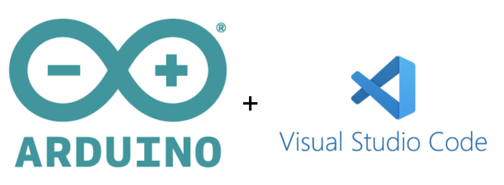

## Motivating Questions + Objective
- How can I **bridge hardware with software** or **join CAD and code** to create a **3D scanner** that uses this mechanism?
- How can I **connect with my peers** to implement an aspect I did not explore in depth?

**Objective:** To design and demonstrate a **depth-based pan-tilt scanning mechanism** that **integrates CADing, hardware, and software** through the **power of teamwork**.

## Materials
- VS Code
- Arduino IDE
- Fusion 360 for CAD modeling  
- 2 stepper motors (25mm tall NEMA 17)  
- Screws and mounting hardware
- UNO R3 Super Starter Kit
- Sharp GP2Y0A21YK0F IR Distance Sensor
- USB cable
- Completed & printed gimbal

## Step-by-Step Process
1. **Starting high:** Coming out of Thanksgiving break, I was still riding the momentum of finishing the design early. I immediately asked Patrick if he had made progress on the code. He said he had. At the time, we had split responsibilities. I focused on CAD since I already had a design, and he focused on coding. I assumed things would move quickly from there.
2. **Hit of reality:** That assumption turned out to be wrong. Very wrong. No group had a fully working code at that point. In fact, more than a week passed before any code was able to move the mechanism. While waiting, I tried to gain a better understanding and appreciation of the coding team’s work. Personally, I think of myself more as a coder than a designer, so I was also interested just in general about the programming side. However, after Mr. Raus introduced laser cutting, most groups pivoted toward that approach, and my ball-based mechanism was ignored before it had a chance to be tested.
3. **A week of lows:** For a while, I did not know who to work with. Patrick began collaborating with Colin on a different path in which my mechanism was completely unneeded. When I reached out to Charlie, he did not have any code and was not very responsive. With the deadline approaching and finals coming up, I realized I needed to collaborate with someone who already had code and some experience. That decision was difficult because I was technically assigned to Patrick.
4. **Reaching out:** I started paying more attention to the people around me, especially those I had worked well with before. During Sunday's community dinner or the last one of 2025, I talked to Thomas, who I sit next to. He had code but no fleshed-out mechanical system, while I had a mechanism but no code. We decided it was a good fit and partnered up. I taught him how the design worked, and he walked me through the state of the code. From there, I was a part of Thomas and Kayden’s group.
5. **Finding time:** Finals were happening, and everyone was stressed and exhausted. On top of finals, I had a tennis tournament, an SAT, and science fair work to stay ahead on. I had to be extremely efficient with my time and sacrifice some personal relaxing time. While that was difficult and very tiring, the result felt worth it, and I was proud of what I managed to accomplish under pressure. I felt like I had evolved to just handle and be able to accomplish more per day, per week, per month. 
6. **Until the last minute:** The night before the deadline, we discovered a critical mechanical issue. I had to CAD a fix that needed to work on the first try, which is something that rarely happens in 3D design. I know it has never happened for me. It did not work initially, so we went to the robotics lab and drilled out a whole quarter of it. That adjustment fixed the problem and stabilized the bottom stepper motor, which had been too loose, causing shaking and distorting the scanned results.
7. **Demonstrate final form:** We presented on Thursday after a long morning of preparation, starting at 5:45 AM. I checked into the library as early as possible to do printing and the final assembly. Despite the stress, the presentation went well, and I finished Tech Seminar semester one on a high note.

<video controls width="600">
  <source src="images/lidar-test1.mp4" type="video/mp4">
</video>
<video controls width="600">
  <source src="images/lidar-test2.mp4" type="video/mp4">
</video>
<video controls width="600">
  <source src="images/lidar-test3.MP4" type="video/mp4">
</video>

## Problems + Solutions
- **Finding my group:**Patrick left without proper notice and shifted his focus entirely to laser cutting, becoming unresponsive to the idea of a ball mechanism. Colin was initially interested but soon left with Patrick. At that point, I realized I was on my own and needed to make adjustments quickly. I tried reaching out to Charlie, but he said he did not have any code and was not really looking to partner up. I felt very lost, especially knowing that the project counted and deadlines were approaching. I looked around and identified two other possible groups, but I did not have a clear way to communicate with them by the time I was pondering which one to join after class. While thinking about my options, I decided to use community dinner as an opportunity to talk things through. That is when I spoke with Thomas about collaborating with his group, and in the end, I was able to form a partnership and move forward from there.
- **Last-minute fixes:** Noticing a critical problem at the last minute is never fun. That is exactly what happened. The stepper motor at the bottom of the mechanism was shaky due to the movement, something I did not expect or plan for when designing. Unlike the motor fitted inside the ball itself, the bottom motor was not a tight fit. To fix this, I decided to design an insert, a plug that could slot into place and hold the motor securely. I designed it the morning of the presentation and printed it that same day since we had only noticed the issue the night before. I planned carefully, adjusted quickly, and made sure everything worked as intended.

## Main Takeaways  
- **Fixing intuitively:** Throughout this process, I messed up on multiple occasions, and the only reason I was able to stay on track and keep going was that I did not overcomplicate my solutions. Interestingly, most of these fixes involved a drill. The first time was when I designed the other half of the ball incorrectly, causing it to rotate the wrong way. Drilling out the hole so the D-shaft could not catch it worked perfectly. The second time was when the plug I designed did not account for the wire outcropping area. Once again, a drill solved the issue by removing a quarter of the plug. The last one was when the D-shaft was too loose inside my mechanism, so I had to hot-glue most of the parts so that they would stick together. These moments taught me that simple, intuitive fixes can often be more effective than complete redesigns. 
- **Finding my people:** In team projects, you cannot expect everything or everyone to follow your wavelength or even your goals. Everyone has their own agendas and priorities, and while I already knew this from past experiences, living through it is always a learning process and not the most fun one. I do not blame anyone, but if I were all-powerful, I know I would have tried to change some people’s minds to push for what I wanted to see in the final result. Since that is obviously not possible, I have learned that I need to find people I trust and work well with. Forcing myself or others into a direction is not fair to either side. Moving forward, I want to keep this in mind and focus more on compromise and communication at every step instead of getting ahead of myself.

  

## Reflection
I came into the project more confident than I probably should have been. I had gotten ahead early and built something that felt genuinely functional, so it hit hard when others seemed not to really care about it. It felt like all the effort and emotion I had put into the design was wasted, and I started doubting whether I even deserved that initial pride. At one point, I considered scrapping the whole idea and just following along with my partner’s direction. Instead, I took a step back, paid attention to my options, and looked for people I knew I could work well with. While Thomas was not my first choice, he was available, familiar, and easy to work with, and that ended up making all the difference.

I think this project was more of a social project than an engineering one, even though it was an engineering challenge in every way. Most of the difficulties I faced over these weeks were not technical, but instead involved connecting with people and finding a group where I could fully apply myself. There were a lot of ups and downs, but I am glad everything worked out in the end and that I had a final result to show, because that was never guaranteed.

Walking out of semester one, I feel like I have grown not just technically but also as a collaborator and peer. Tech Seminar pushed me into areas I hadn’t really explored before: CAD, 3D printing, sensors, motors, and new ways of thinking about code. Almost all of this was new to me, and I tried to take the challenge head-on. Through reflection and journaling, I made sure to pull something meaningful out of every stage of the process. Looking back, I feel like I really and completely engaged with the project and did myself justice.
