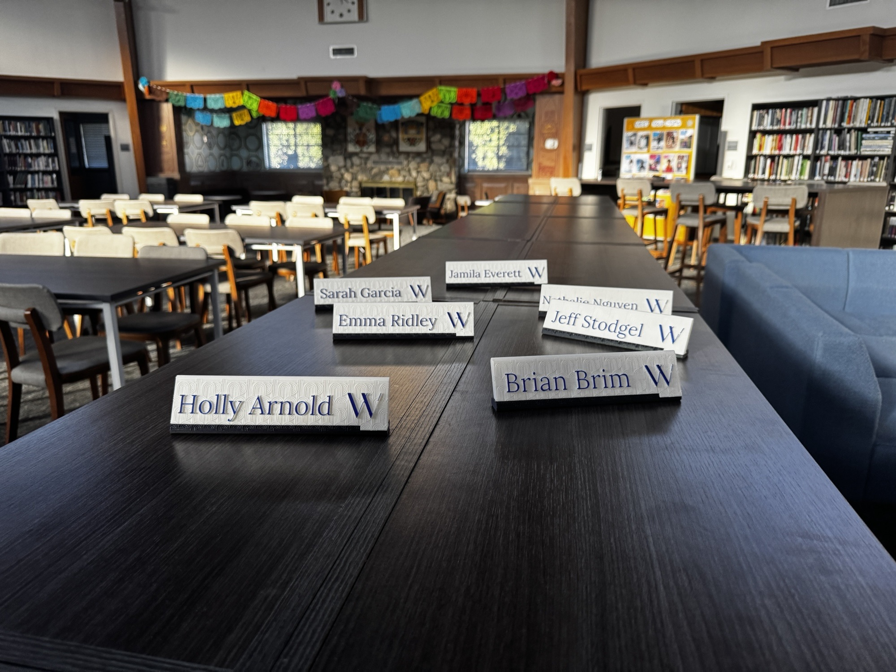
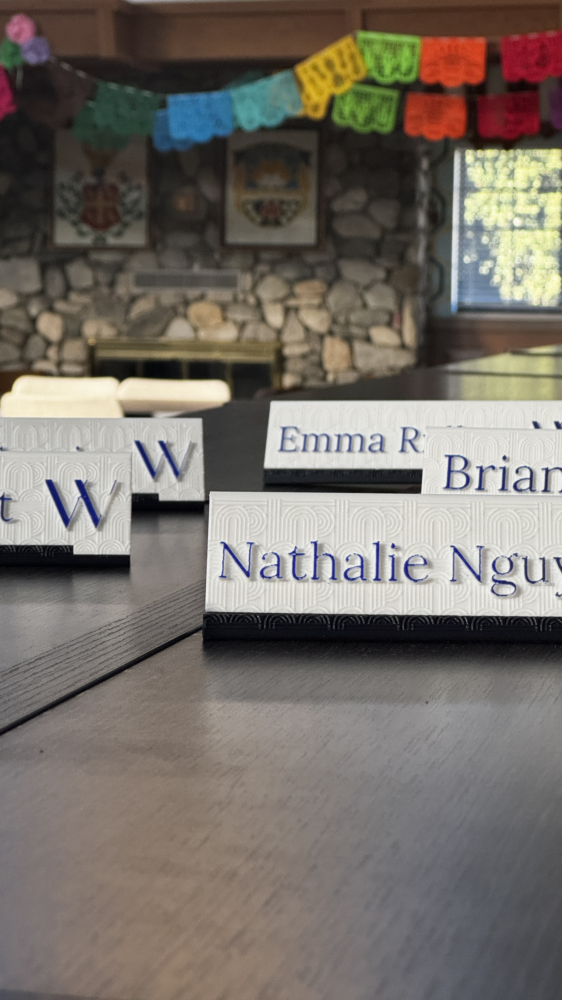
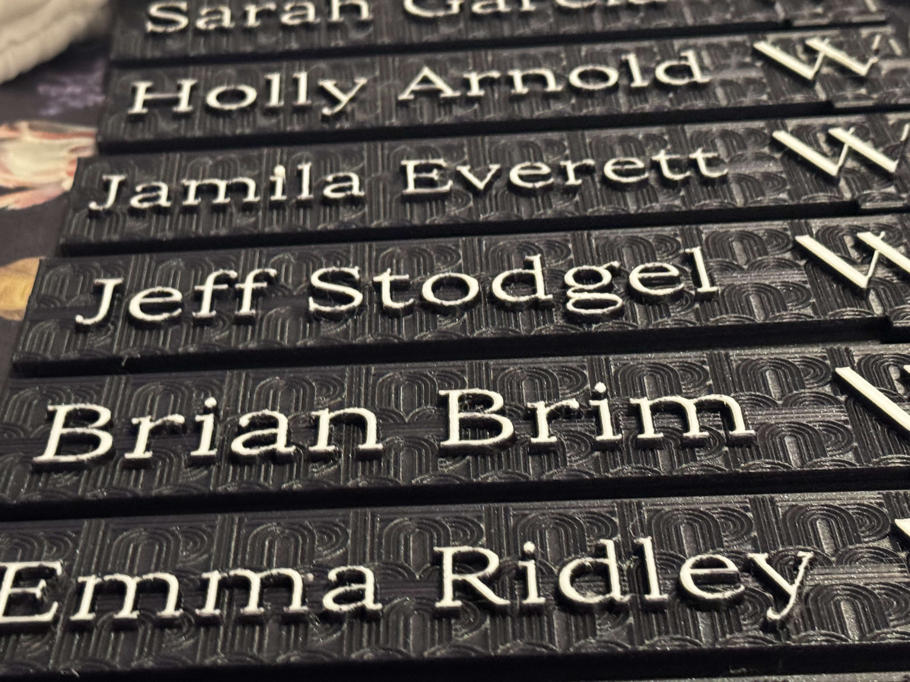
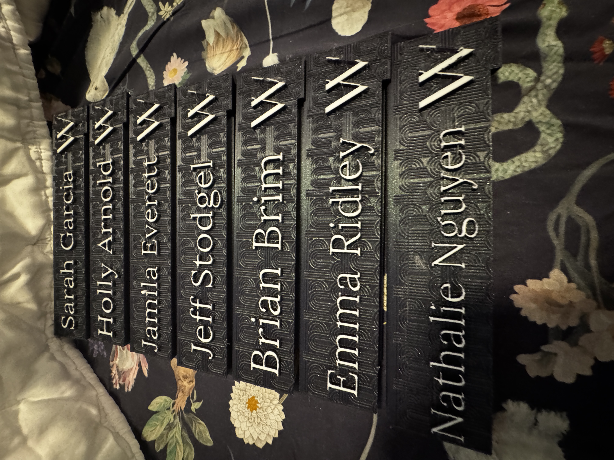

# PNP Showcase

For PNP, I designed and produced the sign with its **custom font**, **special pattern**, and **locking mechanism**. This project made me master new features, troubleshoot failed prototypes, and finally produce a working product using CAD and 3D printing.

## Iteration Process

I went through many iterations:

1. **First Print** – Too thin; the locking mechanism didn’t work. I had never 3D-printed anything before this, so this first print introduced me to slicing, print preparation, etc.   
   

2. **Second Print** – Tripled the thickness, but the margins between parts were too small for the lock to slide in.  
   

3. **Third Print** – Added custom fonts and adjusted spacing. The mechanism fit but with difficulty, and the text printed poorly on the WEBB logo because of the font's thin lines.  
   

4. **Fourth Print** – Locking mechanism worked: I made only a small section a tight fit to reduce friction, but it was strong enough to hold the sign in place. I also fixed the font issues by manually trying the sizes until I found one that did not miss parts of letters after slicing.  
   

5. **Fifth Test** – Verified the mechanism worked across different names and variations.  
   

In total:  
- ~13 plate designs and ~8 base designs explored (excluding final versions) 
- 5 full 3D prints (not counting final versions with different names)  
- Countless tweaks in CAD before sending files to print
- Learned how to import fonts, make rectangular patterns, and cut to fit within boundaries in Fusion.   

---

## Final Day

After preparing final designs with multiple names after 30 minutes, I discovered the printer nozzle was **0.4 mm** minimum, not the 0.2 mm we had planned for. This meant the pattern would not print correctly.  

With less than 40 minutes before the library closed, I had to **remake the pattern and re-do all the names** to be compatible with the 0.4 mm nozzle. I finished with only a few minutes to spare, just in time to send in the final print.

---

  <video width="48%" controls>
    <source src="images/pnp-printing1.mp4" type="video/mp4">
    Your browser does not support the video tag.
  </video>
  <video width="48%" controls>
    <source src="images/pnp-printing2.mp4" type="video/mp4">
    Your browser does not support the video tag.
  </video>

  <figure style="width: 48%; text-align: center; margin: 0;">
    
    <figcaption style="margin-top: 6px;"><i>Thin first design</i></figcaption>
  </figure>
  <figure style="width: 48%; text-align: center; margin: 0;">
    
    <figcaption style="margin-top: 6px;"><i>Thicker second design</i></figcaption>
  </figure>

    
    

Final results with white

    
    

PNP taught me that design is about **iteration, adaptation, and persistence**. My final locking sign mechanism is a product of every failed prototype and attempt that came before it.
