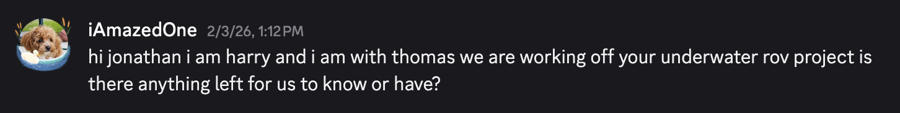
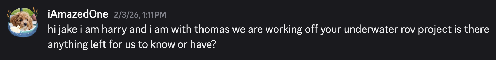

## Motivating Questions + Objective
- How to **respect** and **revive** another group's work, **building off of it** while **communicating with the group itself**?
- How to design an **underwater ROV** that has **six degrees of freedom**, **eight propellers**, and **waterproof needs**?
- How to get an underwater ROV to be **able to run**?

**Objective:** To **respectfully revive** Jake and Jonathan's **previous work**, designing and building an **underwater ROV** for the museum

## Materials
- Blue ROV 2
- Jake & Jonathan's old ROV + documentation

## Step-by-Step Process
1. **Find the parts**: we first learned of this project in our Unbounded activity debrief in which we were told of an extra project of building our own ROV so we wanted we give it a try. we then had to get the parts once we got permission which we found by first locating mr hamilton and then finding the rov outside the robotics lab
2. **Reach out**: thomas first called out to jake and jonathan but they ghosted him for a week; then i who was on 359 and thus shared a server with them tried and they replied in a few minutes thats how we managed to get in contact with the two
3. **Acquire documentation**: we asked for the documentation after we got in contact; to get it we explained what we were doing and promised to give them updates; quickly they gave us both a doc with multiple years of their work and access to their cad files
4. **Coordinate a team**: we called in a meeting in the robotics lab and three other people showed up, expressing interest so we have to note that we two are not the only ones with interest and want to make the initiative a reality
5. **Blue ROV 2 first**: after some decisions and weighing our options we wanted to see some part of rov move first so while thomas dissected the rov to look through it and read the instructions, i downloaded the software and tried to get the rov connected it worked but the connection was not on because of a problem we realized right as we started working: there was no battery. That will be a logistics hurdle to solve once we get back from break.
   

## Problems + Solutions
- **Initally ghosted**: we were initally ghosted when thomas reached out this was probably because jake and jonathan have no similar servers or friends with thomas so it looks random or discord could have not allowed thomas to contact them or they have a setting to not show strangers at least when i did it and i shared a 359 server with them they responded so in the end it worked out
- **Having no battery**: we found this as i was connecting the rov to my computer because the rov had no connection even though it was plugged in correct rather the connection was yellow rather than green, so i chalked up to the fact the rov had no power because its battery was missing we noticed this as soon as we started working and something seemed missing no once we get back from break the solution will come from just asking the museum people to get it it might have been placed to the side because the submarine was in a drawer for a long time

## Main Takeaways  
- **Planning for the long term**: the rov project will be a long project if we want to fully complete and it is equivalent to a final if not more thomas and i project it to take us many months and a lot of learning to do before we can see some proper results, far even after the Unbounded activitiy so now after break its just taking advantage of each and every work day to slowly make progress and finish this rov in time
- **Using references/past work**: it was a new experience working off of someone else's work that was so physical and incomplete normally for software its different because its in libraries or packages but this is a physicl product so its strange looking through it felt like looking through the lives and histories of the two so it was a unique experience now we have to accept this responsibility and try to make something out of this project

  

## Reflection
i think thomas and i bit off a lot for us to chew i dont know if its impossible for us but it is certainly going to be very challenging so we hope to do our best and see some results the time we had was relatively short because we just did not have all the parts and a plan to go about it, and even less the expertise to be able to start building right now its a slow process of learning as we go hoping to have something to show off occasionly

its a bit to early to tell exactly how far we can go with this project but im excited to continue to work after february break where we can rest finally and come back refreshed
