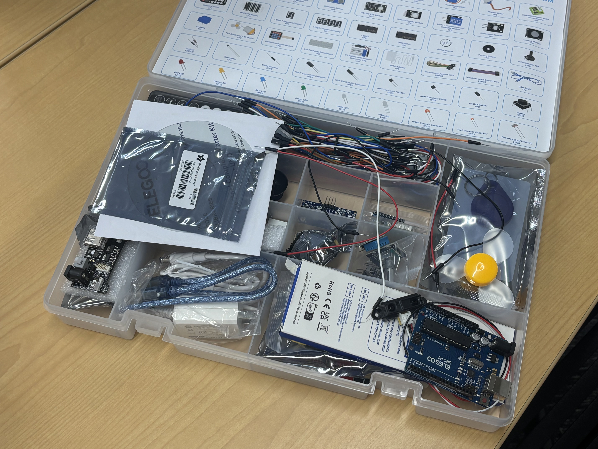
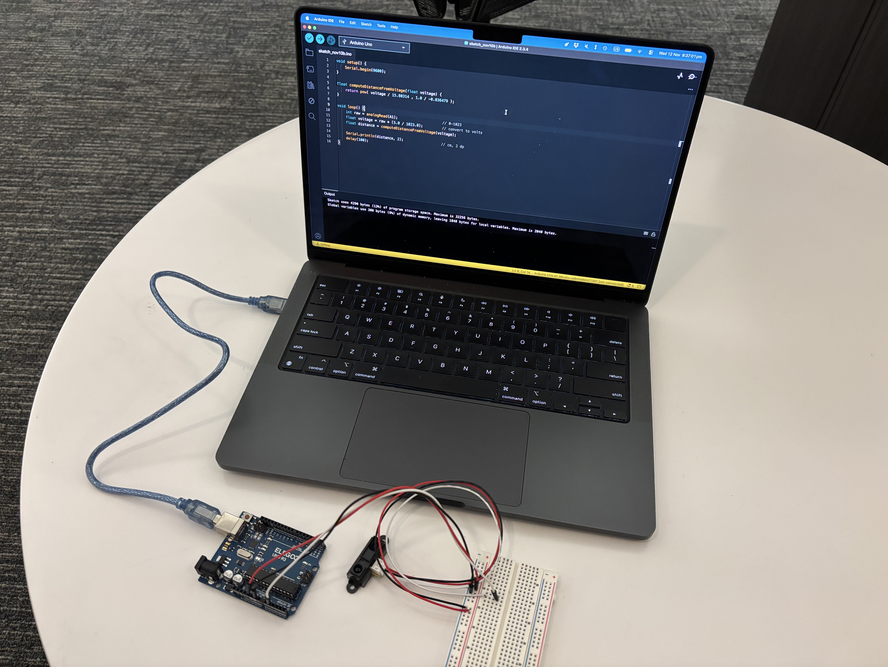

# 3D Scanner 

## Motivating Questions + Objective
- How does the **sensor** work? How does the **arduino** work? How does the **computer** fit into this? 
- How do we set up a sensor, arduino, and computer to get a result?
- How do we translate analog voltage readings into precise distances?

Objective: Create a **3D scanner** that uses **Sharp GP2Y0A21YK0F analog IR distance sensors** to measure **distance between physical objects**.

## Materials
- Computer that can run code
- UNO R3 Super Starter Kit
- Sharp GP2Y0A21YK0F IR Distance Sensor
- USB cable
- Measuring tape
- Desmos

    
    

## Step-by-Step Process

## Problems + Solutions
- **Unstable wires**: Our first problem was that the sensor wires kept popping or dropping out of the breadboard. We were not tugging or handling it with abandon, but they kept falling off, causing inconsistent readings. We fixed this by being extra careful when handling the setup, making sure all connections were secure. This helped make the data much more reliable.
- **Flipped equation**: The second problem was that we accidentally flipped our equation when inputting values into Desmos for a power regression. We were converting distance to voltage instead of voltage to distance. I realized the mistake when I looked at the graph on the provided website while thinking about inverse functions, which Mr. Raus mentioned a minute before. Catching that error helped us correct the voltage response to get accurate distance. 

## Main Takeaways
- **The basics**: I learned how to incorporate the sensor measures distance, detecting reflected infrared light and converting it into an analog voltage, into a system with an Arduino that reads and translates them with code from a computer into real-world numbers that show distance, becoming a full, realized, analog distance sensor. Along the way, I learned ideas involving setting up circuits, working with wires, etc to see how each part contributes in this functioning system.
- **Connectivity**: This is my first time working with proper hardware like Arduino and sensors, and it showed me the parallels between hardware and software. The main one is that that despite the change, everything still connects to one another in a beautiful way to create a complex system. I am used to coding, but this project pushed me out of my element to appreciate more of the hands-on, tangible side of engineering. 
- **Organization**: Managing the wires, sensors, and tools required much more organization than I expected. Unlike code files that are easily rearranged, hardware needs careful setup every time and proper cleanup, including storing parts in boxes and putting everything in a container. This was a new level of attention to detail which, even with the kit's help, was still fresh and a bit new to me, despite my experience in robotics during the fall. 

## Reflection
At the start, I felt nervous, not just because I was trying something new but because I had been wanting to work with Arduino and hardware for a while but never actually started. So when the unit was announced, I was unsure what I would be able to do or hwo well I would understand everything. As I made progress, I started to feel a shift in feeling from nervousness to mroe curiousity with the confidence to try and explore the concepts, rather than overestimate and shy away from them. I began to draw parallels between hardware and software, realizing the same intrinsic skills like problem-solving or decomposition apply here too. With these parallels, I began to grow more comfortable, learning to approach this new process with patience and a willingness to experiment. I know there is still a lot more to learn, but I think my biggest change has been my ability to feel justified in asking and learning about this topic. This experience connects to my broader journey of discovery within the field of engineering I am drawn to. Seeing it from a new angle academically with the new knowledge and ability but also personally by reinforcing my belief in strengthening my ability to adapt and learn with new ideas, building new connections like what I have been pracitcing in class these past few classes. 
