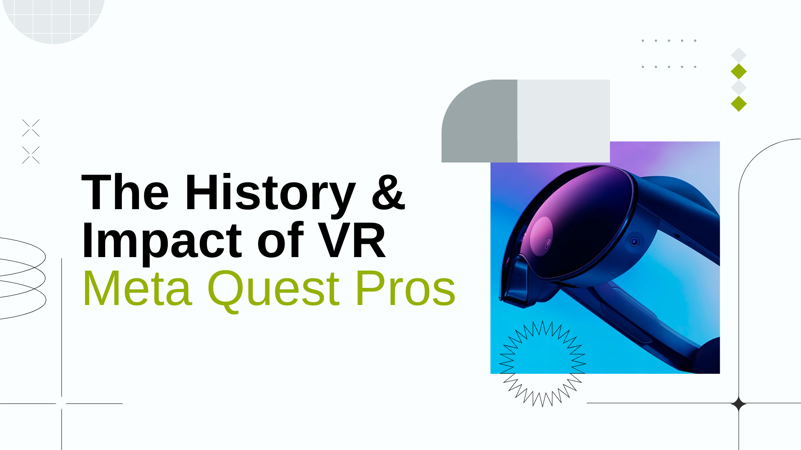
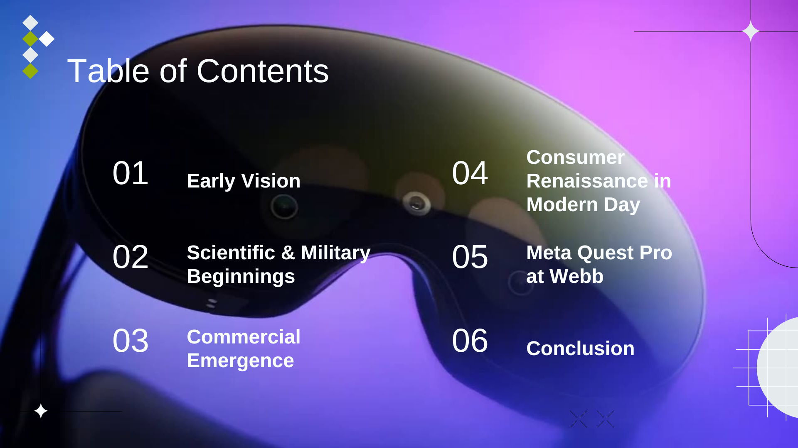
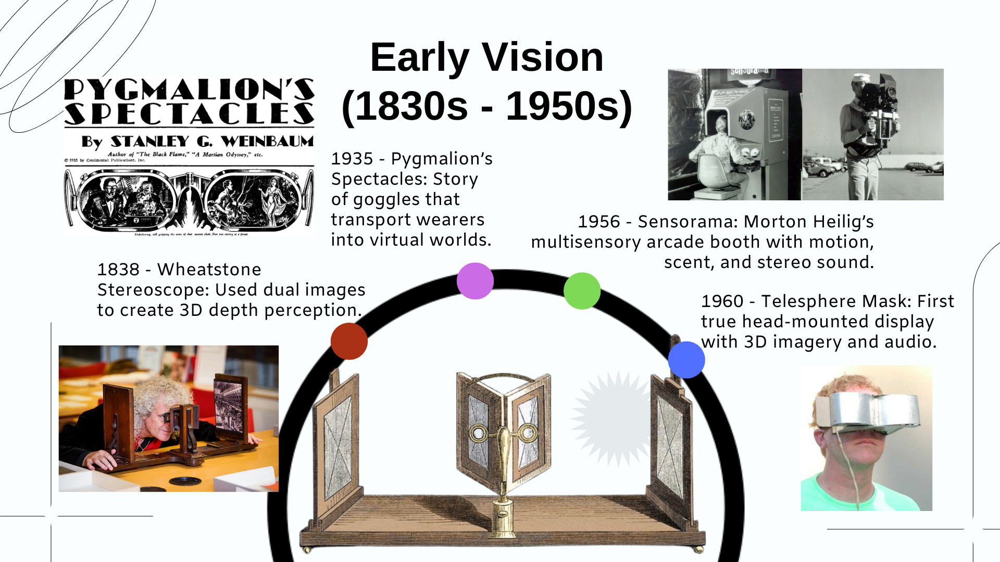
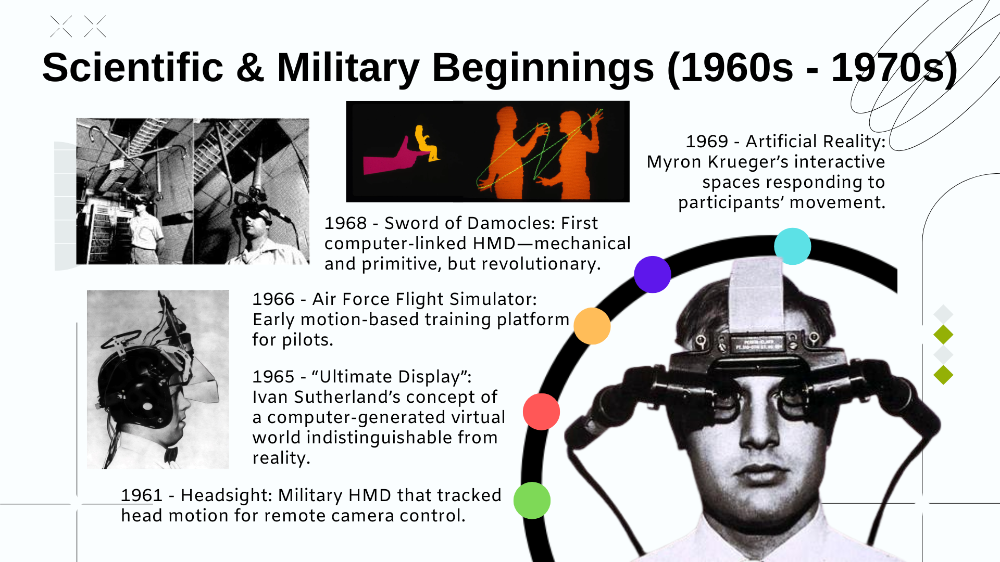
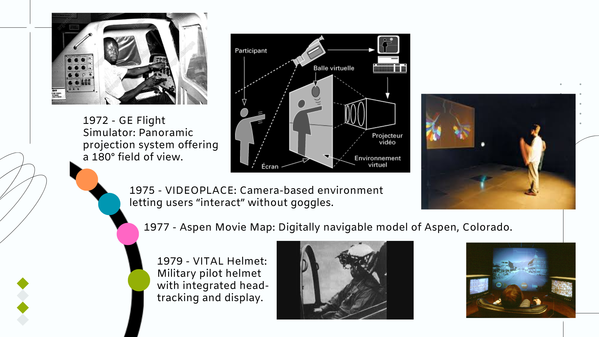
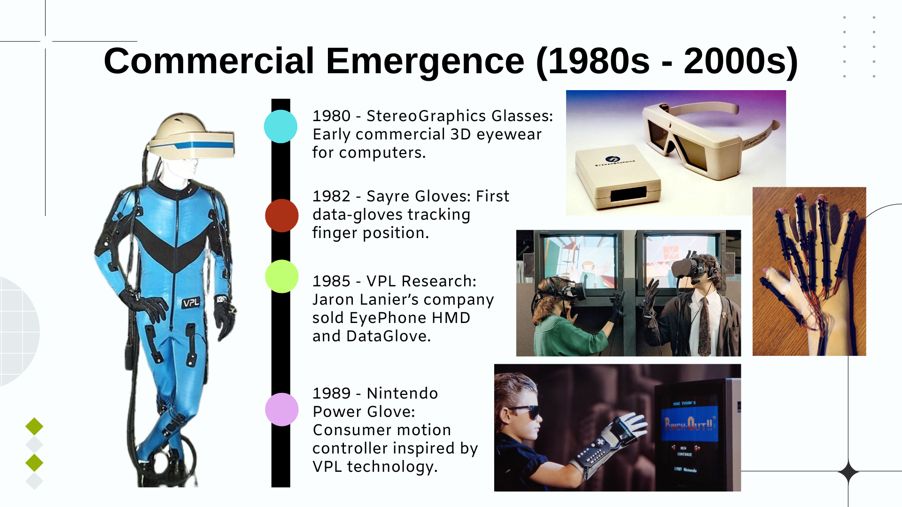
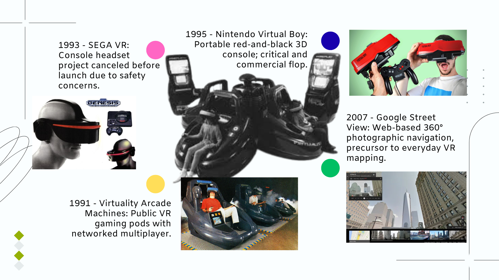
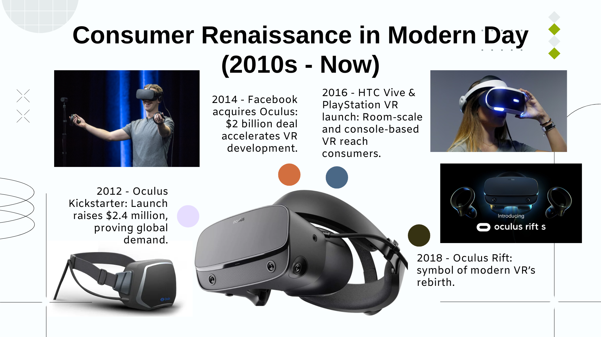
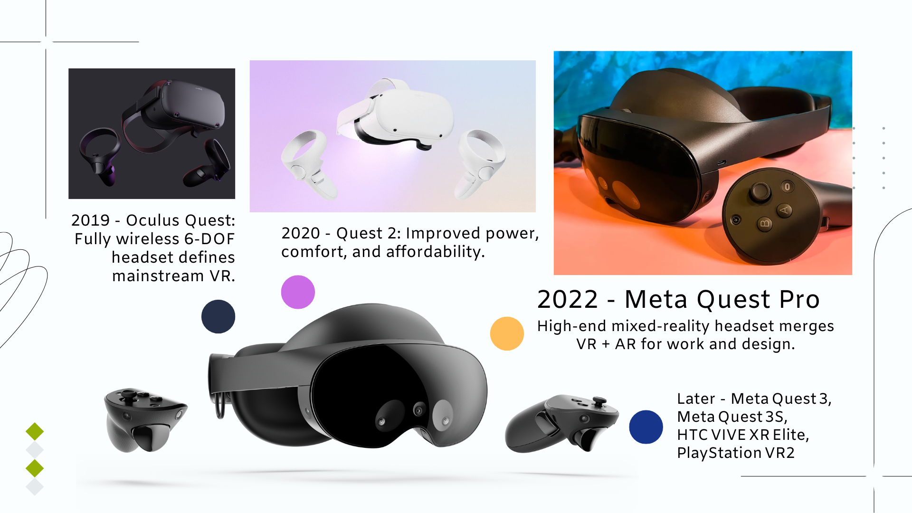
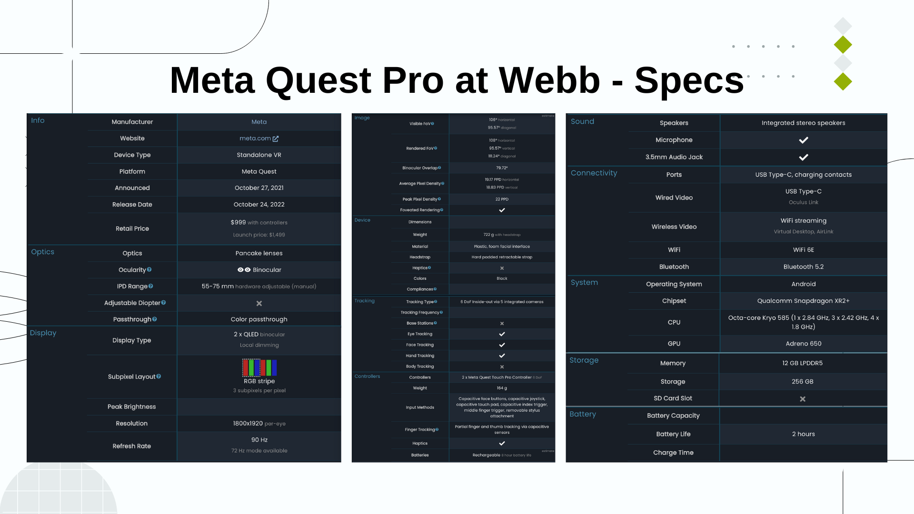

# Macro-sprint SDG 10.3: Beyond Accessibility: - Design for Elderly in the Digital Divide

  

    
  

  

    
  

  

    
    
VR, like any other technology, began as an idea. The first kind of invention was the stereoscope, which created the first 3D illusion using two images. Then, works like Pygmalion's spectacles foresaw goggles that could take people to other worlds. Soon, devices began to do something along those lines on a very basic level.

  

  

    
    
In the 1960s and 70s, VR became a real research field, originating in military and scientific applications similar to the inventions of the space race. Ivan Sutherland’s “Ultimate Display” and the Sword of Damocles created the first computer-linked headsets.

  

  

    
    
The military used simulators to train pilots safely. Artists like Myron Krueger experimented with interactive rooms that reacted to movement.

  

  

    
    
Like all technologies, VR began to be commercialized. In the 80s and 90s, VR became public. The tech was expensive and not very advanced.

  

  

    
    
Soon, by the 2000s, projects like Google Street View began to find practical uses for VR. In the case of VR, it was more created as an innovative piece of technology itself rather than to solve a specific problem.

  

  

    
    
Soon, VR began to really develop with Oculus, which Facebook acquired, and then different productions. Anyways, 2022 rolls with the Meta Quest Pros.

  

  

    
    
There is more advanced stuff past 2022, but the focus will be on the Quest Pros because they are what we have at Webb.

  

  

    
    
The Quest Pro was not just faster. It fundamentally changed what VR could do. It used dual Mini-LED screens, better lenses, eye and face tracking, and full-color passthrough. You could see the world while still in VR.

  

  

    <video width="100%" controls autoplay muted loop>
      <source src="images/vr11.mp4" type="video/mp4">
    </video>
    
Basically, it turned VR into a full-on mixed-reality platform. This is the Meta Quest Pro promotion video. VR is a very important technology today because it connects people and ideas in new ways.

  

  

    <video width="100%" controls autoplay muted loop>
      <source src="images/vr12.mp4" type="video/mp4">
    </video>
    
Examples are doctors practicing surgeries, engineers testing designs, students exploring anywhere in the world, veterans with PTSD being able to go through therapy by visiting the place in VR. In essence, it reduces distance and builds understanding. From the first stereoscope or idea in some novel to now, the Meta Quest Pro in our Webb library, VR has come quite a long way.

  

  <a class="prev" onclick="plusSlides(-1)">&#10094;</a>
  <a class="next" onclick="plusSlides(1)">&#10095;</a>

