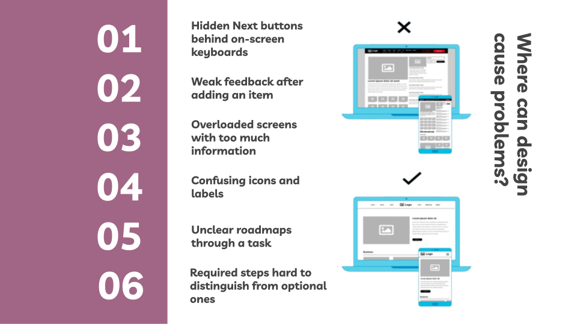

# Macro-sprint SDG 10.3: Beyond Accessibility: - Design for Elderly in the Digital Divide

  

    
  

  

    
  

  

    
  

  

    
  

  

    
  

  

    
  

  

    
  

  

    
  

  

    
  

  

    
  

  

    
  

  

    
  

  

    
  

  

    
  

  <a class="prev" onclick="plusSlides(-1)">&#10094;</a>
  <a class="next" onclick="plusSlides(1)">&#10095;</a>

 

  
  
  
  
  
  
  
  
  
  
  
  
  
  

