# VR Show & Tell

To show off the capabilities of VR inside our school, I built a scene on **Unity** and connected it to the **Meta Quest Pros**, creating an experience that allows the user to **move around and view models**. This project made me master a new software I had never used before, fight the limits of Macbook and Windows, and troubleshoot the fickle VR headsets. I expanded on my patience and willingness to explore deeper into topics more foreign to me. 

## Overview
**Virtual Reality (VR)** is a technology that **immerses users in a simulated environment**, allowing them to experience digital spaces as if they were physically there. Using headsets equipped with motion sensors and stereoscopic displays, VR tracks the user’s head and hand movements to render a 3D environment where the user can interact and play around with its contents.

Inside the library lie the Meta Quest Pros. It leverages high-resolution visuals, advanced tracking, and controller input to create a realistic experience for users. The Quest Pro’s capabilities include full-color passthrough, spatial mapping, and precise gesture recognition built for design, collaboration, and learning.

The impact of VR is that it **reshapes how people visualize data and connect across distances**. VR allows learners and creators to **turn their abstract ideas into experiences of tangible space and interaction**.

## History and Impact

  

    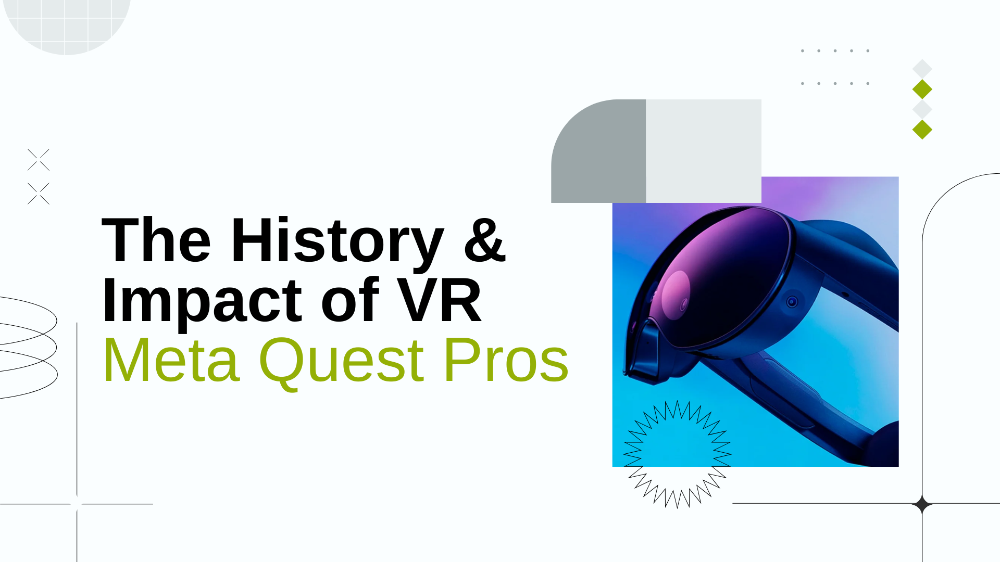
  

  

    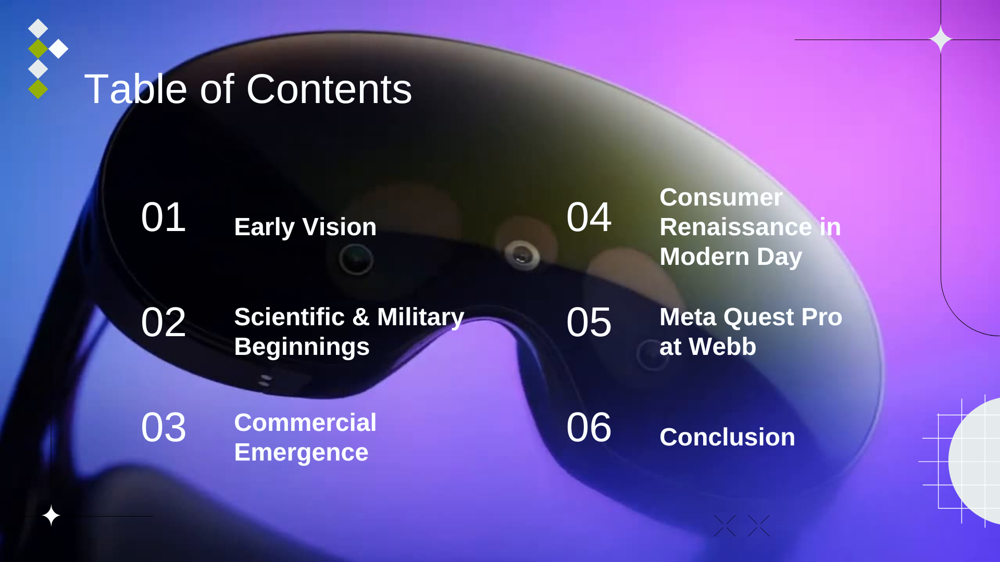
  

  

    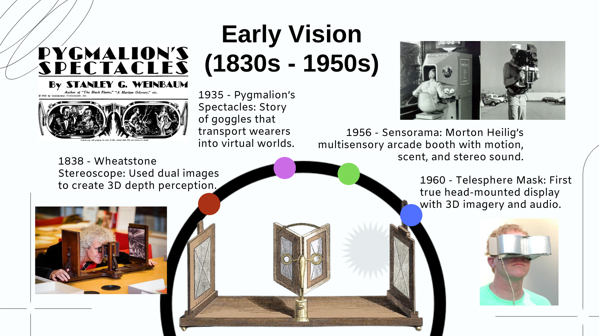
    
VR, like any other technology, began as an idea. The first kind of invention was the stereoscope, which created the first 3D illusion using two images. Then, works like Pygmalion's spectacles foresaw goggles that could take people to other worlds. Soon, devices began to do something along those lines on a very basic level.

  

  

    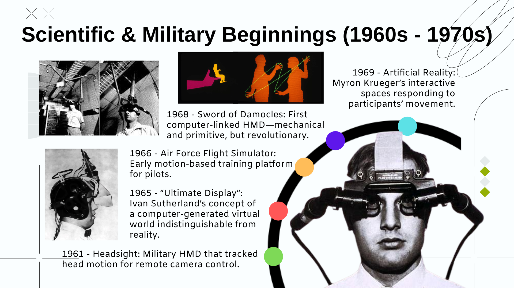
    
In the 1960s and 70s, VR became a real research field, originating in military and scientific applications similar to the inventions of the space race. Ivan Sutherland’s “Ultimate Display” and the Sword of Damocles created the first computer-linked headsets.

  

  

    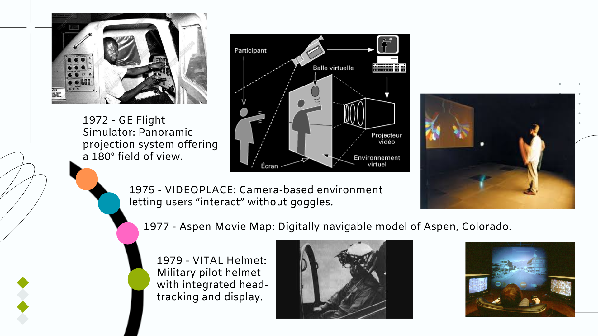
    
The military used simulators to train pilots safely. Artists like Myron Krueger experimented with interactive rooms that reacted to movement.

  

  

    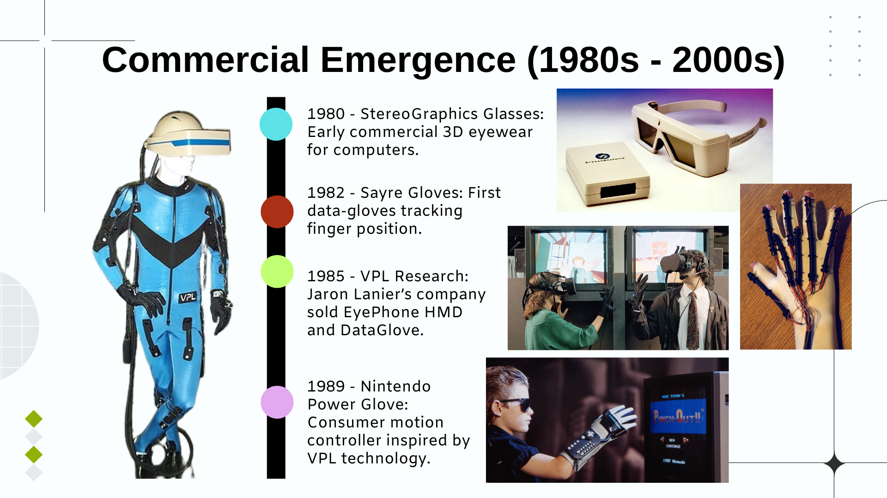
    
Like all technologies, VR began to be commercialized. In the 80s and 90s, VR became public. The tech was expensive and not very advanced.

  

  

    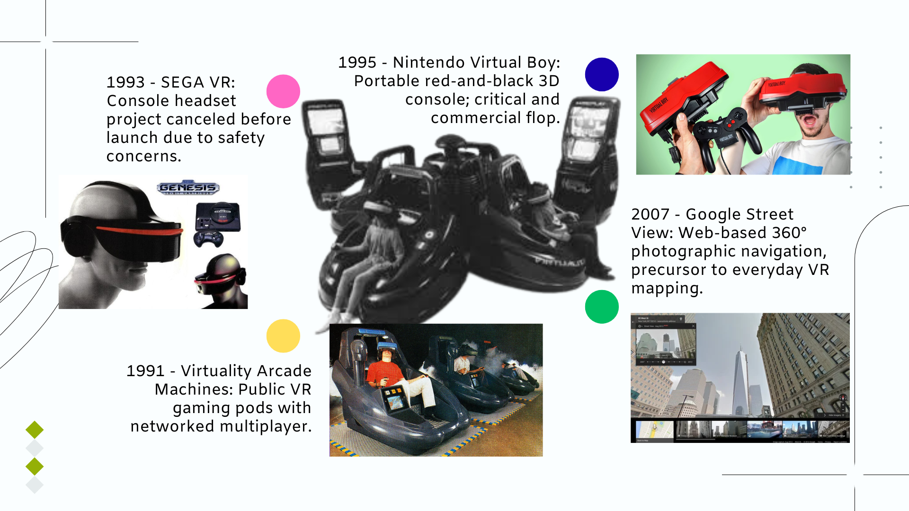
    
Soon, by the 2000s, projects like Google Street View began to find practical uses for VR. In the case of VR, it was more created as an innovative piece of technology itself rather than to solve a specific problem.

  

  

    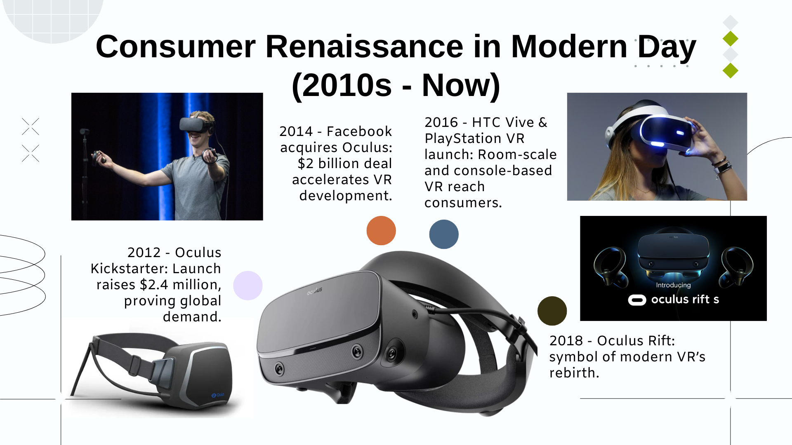
    
Soon, VR began to really develop with Oculus, which Facebook acquired, and then different productions. Anyways, 2022 rolls with the Meta Quest Pros.

  

  

    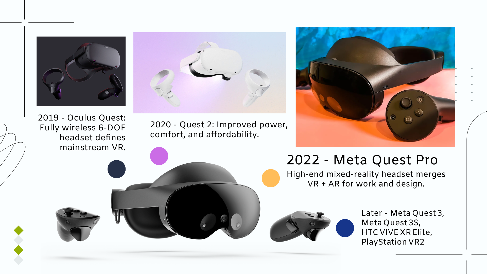
    
There is more advanced stuff past 2022, but the focus will be on the Quest Pros because they are what we have at Webb.

  

  

    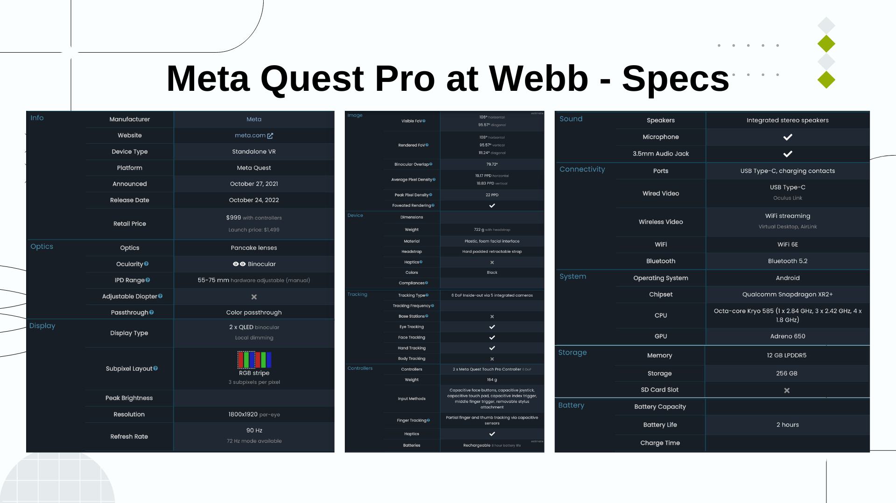
    
The Quest Pro was not just faster. It fundamentally changed what VR could do. It used dual Mini-LED screens, better lenses, eye and face tracking, and full-color passthrough. You could see the world while still in VR.

  

  

    <video width="100%" controls autoplay muted loop>
      <source src="images/vr11.mp4" type="video/mp4">
    </video>
    
Basically, it turned VR into a full-on mixed-reality platform. This is the Meta Quest Pro promotion video. VR is a very important technology today because it connects people and ideas in new ways.

  

  

    <video width="100%" controls autoplay muted loop>
      <source src="images/vr12.mp4" type="video/mp4">
    </video>
    
Examples are doctors practicing surgeries, engineers testing designs, students exploring anywhere in the world, veterans with PTSD being able to go through therapy by visiting the place in VR. In essence, it reduces distance and builds understanding. From the first stereoscope or idea in some novel to now, the Meta Quest Pro in our Webb library, VR has come quite a long way.

  

  <a class="prev" onclick="plusSlides(-1)">&#10094;</a>
  <a class="next" onclick="plusSlides(1)">&#10095;</a>

 

  
  
  
  
  
  
  
  
  
  
  
  

## Creative Process
1) Brainstorming: Started with only the certainty that the project would use VR in some way. Dr. Dzula inspired me to make something that would immerse you, showing a model or object. 
2) Choosing a platform: I knew that to make something like that, you needed a design platform. I began with SimLab, which I managed to run on the headset. However, the limit of 5 uploads, movement issues, and a corrupted final file led me to discard the idea.

    
    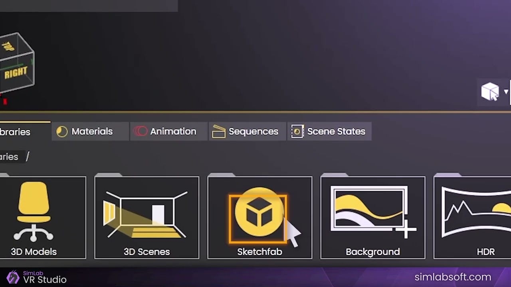

3) Starting over: After that setback, I decided to start from scratch. After surveying my options, I moved to Unity, a pursuit started thanks to a suggestion from Thomas.

4) Learning Unity basics: At first, I had to figure out Unity’s 2D vs 3D views along with every other feature. I also got stuck for an hour because I did not realize that scrolling out resized the scene view to full screen, and I did not know that scrolling in would reset it. After many hours, I started to settle into the software
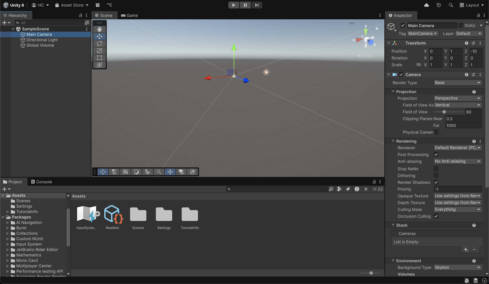
5) Building the environment: I used PNP as a reference for modeling and lighting. I added movement and turning systems after several trial-and-error attempts, finally achieving freedom of viewing and navigation after many hours.
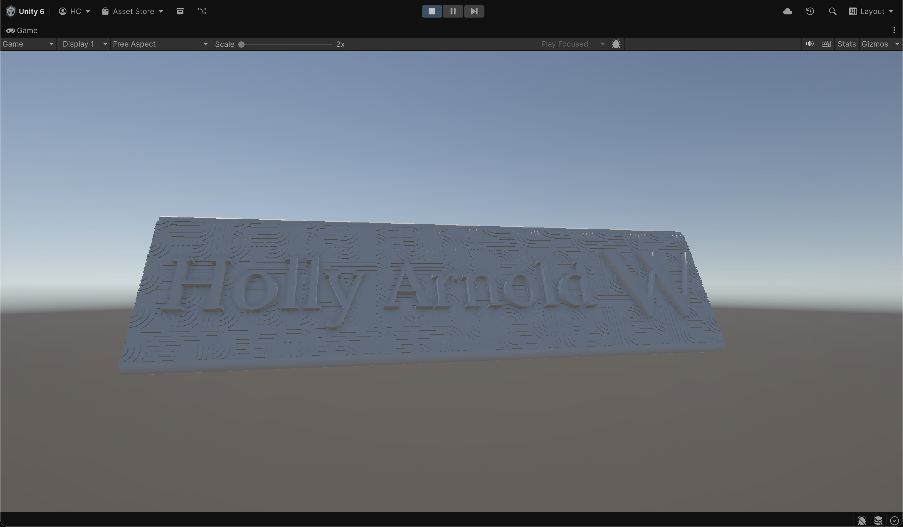
6) Adding detail: I added a skybox to bring life to the scene. I then imported a collection of random models that would work inside Unity to give a bit of diversity to the scene. For each model, I had to add its textures. This sounds easy, but the learning curve was steep, and some models had a lot of textures, each of which I had to sort through and find its corresponding box. For one, I had to assign 91 textures to their correct part. 

    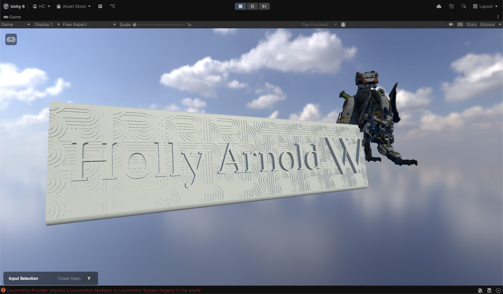
    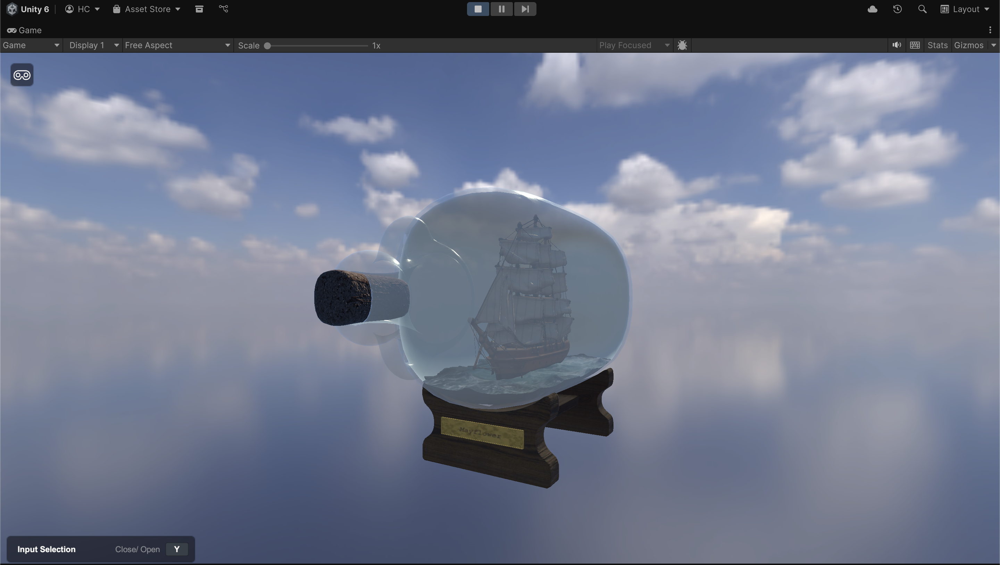

    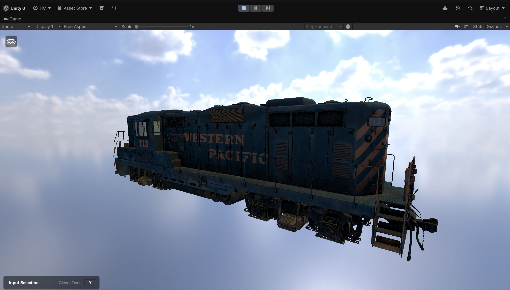
    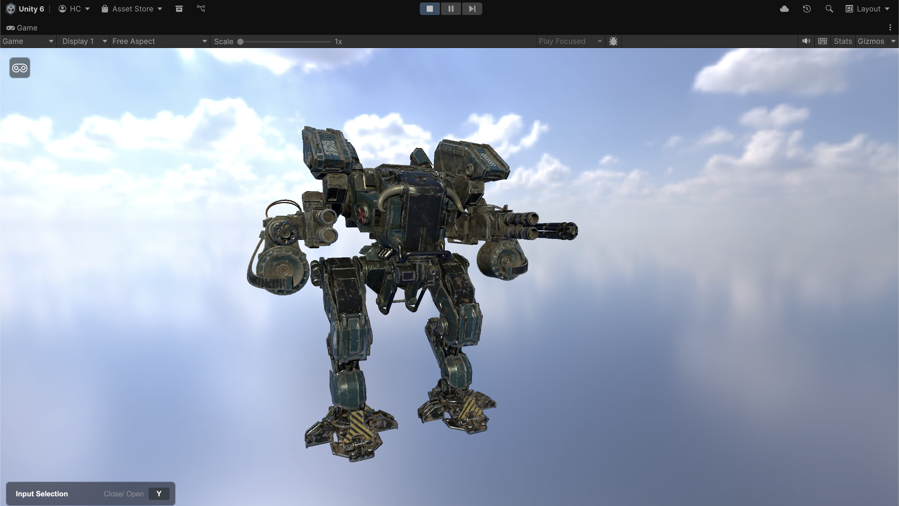

7) Transitioning to VR controls: I switched all the standard controls to VR-based inputs, sorting through countless messy prefabs and folders until I got the controller reacting properly.
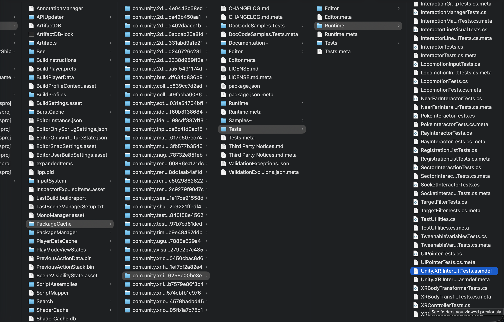
8) Testing with the XR Simulator: I used the XR Interaction Simulator to test motion and interaction inside the editor before headset deployment.

  <video width="90%" controls autoplay muted loop style="border-radius: 10px;">
    <source src="images/unityvrsimulator.mp4" type="video/mp4">
    Your browser does not support the video tag.
  </video>

9) Platform challenges: I faced compatibility issues as I tried to connect the two. The Meta Quest Pros support Android and Windows, but I was building on a MacBook, which required me to make many adjustments and find methods to export properly.
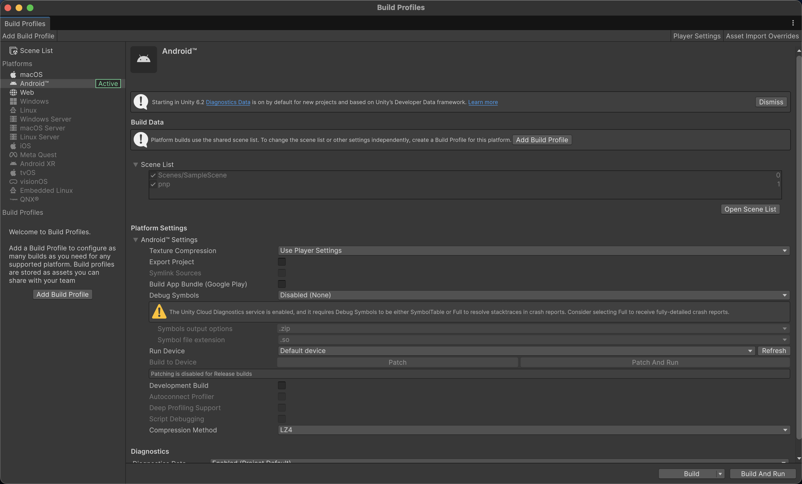
10) Final build: After resolving input handling, platforms, and model conflicts, I successfully compiled the project into an .apk file, a small representation of the larger whole of my VR world and experience.
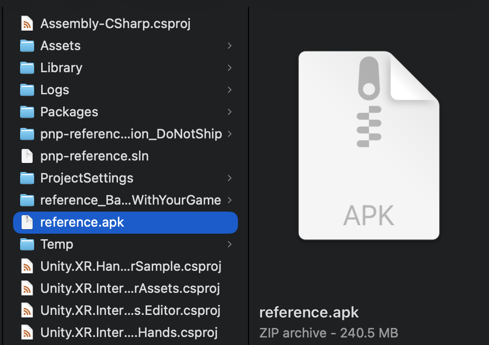

## Reflection
This process taught me quite thoroughly the importance of **patience** when working with more complex tools like Unity or Meta Quest Pro. I noticed that each setback would eventually force me to slow down first to problem-solve and analyze the issues. Additionally, this patience has to be hand-in-hand with a level of persistence that allows you to see results. I know if I had not slowed down and taken the process in, I would have probably flubbed longer, rushing the process. My takeaway is that progress in **innovation comes from tenacious calmness**. 

